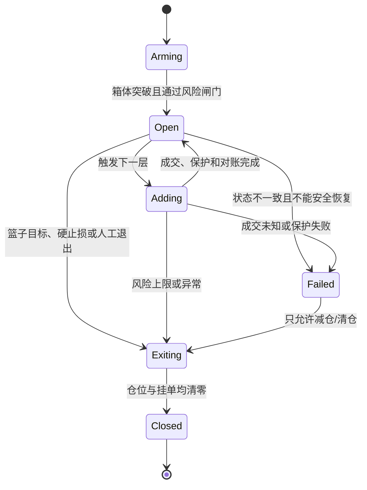

# 《马丁 TP4》MQ4 策略与 QuantDesk 适配分析

> 分析日期：2026-09-01
> MQ4 文件：`D:\Desktop\马丁TP4.mq4`
> 文件版本：`3.00`，内部修订日期 `23.02.2018`，2,556 行，233,022 字节
> SHA-256：`A04CB89E57A65B33F35BC497131E51024442CA2996E479BEDD86173916C273C3`
> QuantDesk 代码基线：Git `f293374`
> 线上核对页面：`https://binance.taoz.chat/strategies`

## 1. 结论先行

> **参数化说明**：原 EA 不是把 0.01 手、2 倍、16 层等规则写死。核心交易参数均可配置，本文引用这些数值时，指的是所提供源码中的**默认参数组合**，目的是建立可复现的风险基线，不代表所有配置都会产生相同风险。QuantDesk 的适配目标也应是承接完整参数模型，而不是只移植这一组默认值。

> **数据源决策更新**：策略数据改为直接使用老虎证券接口。Tiger 提供美股 15m/D1 K 线、实时简报、盘口和可选逐笔数据；Binance 只负责合约规则、基差校验、订单、成交、持仓、标记价格和保护。Tiger 数据异常时不得静默切回 Binance K 线产生信号。

### 1.1 是否能直接在当前系统运行

**不能直接运行，当前不建议实盘接入。**

原因不是“缺一个指标”，而是运行模型不同：

- MQ4 是一个有状态的多腿篮子交易执行器，会持续记录一个交易周期中的首单、末单、总手数、综合成本、补仓层级、箱体上下沿和待平仓状态。
- 当前 QuantDesk 策略运行时主要是“历史 K 线 → 单次 LONG/SHORT/HOLD 信号 → 单仓位开平仓”。源码策略是纯函数，不能自行持久化篮子状态；现有回测器也只维护一个 `position`。
- MQ4 的核心是同一品种多次加仓、双向恢复、篮子统一止盈和首尾单配对平仓。现有应用层会对已占用品种返回 `symbol_already_open`，不能按原逻辑继续构建 2～16 腿篮子。
- 所提供配置的默认值为无硬止损、倍数 `mm=2`、最多 16 单；以 0.01 初始手数、单腿上限 100 计算，序列可达到 `0.01 … 81.92, 100, 100`，总计 **363.83 手，即初始手数的 36,383 倍**。这说明系统必须先验证用户选择的参数组合，不能仅因为参数可配置就直接交给实盘。

### 1.2 当前数据是否支持

**现有 Tiger 实时报价和盘口可复用，但历史 K 线链路尚未接入，因此仍是部分支持，不支持立即进行忠实回测与实盘执行。**

截至 2026-09-01 15:21 UTC 的数据库只读核对结果：

| 数据 | 当前状态 | 对原策略的支持结论 |
|---|---:|---|
| 15m OHLCV | 181 个品种，485,695 根；全部至少 50 根 | 支持 22 根 M15 箱体的基础计算 |
| 1h OHLCV | 181 个品种，324,196 根 | 可用于部分品种聚合 D1，但必须补连续性校验 |
| 4h OHLCV | 181 个品种，66,295 根 | 原策略不依赖，可用于风险过滤 |
| 原生 1d OHLCV | **0** | 不支持原策略的 D1 ATR(30) 原始口径 |
| 近两根 K 线的新鲜度 | 15m/1h/4h 均为 181/181 | 当前采集新鲜度可用 |
| 15m 箱体 + 744 根 1h 聚合条件 | 150/181 个品种满足“条数”条件 | 只能算候选集；条数不等于连续无缺口 |
| 最新价 | `ticker` 为每品种一条最新快照 | 适合执行前校验，不是历史 tick 序列 |
| 历史 Bid/Ask、点差、逐笔 tick | 未形成可重放数据集 | 无法忠实模拟盘中穿越、点差拒单和滑点 |
| 账户、订单、成交、持仓 | 已有实盘基础设施 | 可复用，但需要篮子聚合和多腿状态模型 |

原数据库中的 Binance K 线不再作为该策略的主信号数据，只用于现状对照和执行侧研究。现有 `tiger_quotes.py` 已支持实时简报与 Level-2，但需要新增 Tiger Bars、历史回补、交易日历、质量清单、标的映射和 Tiger/Binance 基差门禁。

因此：

- **能做**：接入 Tiger 15m/D1 后，以闭合 M15 K 线重建箱体突破研究版。
- **暂时不能做**：按 MQ4 的 tick 级触发、双向多腿、动态综合成本和 overlap 规则进行可信回测或实盘。

### 1.3 推荐决策

1. 先做“原版语义研究回放”，用于确认它在 Binance TradFi 合约上的收益分布和爆仓尾部，不接真实订单。
2. 再做“受限马丁兼容版”，保留箱体、分层和篮子成本思想，但必须加入总风险、总名义价值、最大层数、灾难止损和重启恢复。
3. 通过模拟盘、Shadow、极小额实盘三道闸门后，才允许正式运行。

当前结论为：**Research GO，Shadow 有条件 GO，Live NO-GO。**

---

## 2. MQ4 实际在做什么

### 2.1 三种模式

源码在第 15～20 行定义三种模式，OnTick 在第 218～265 行分发：

| 模式 | 初始动作 | 后续动作 | 退出口径 |
|---|---|---|---|
| `auto` | 箱体上破做多、下破做空 | 价格穿越另一侧箱体时反向开一腿，手数按层级放大 | 多空合并后的篮子综合成本 |
| `recovery` | 人工先开第一单 | 读取第一单注释里的箱体上下沿，随后在上下沿交替反向开仓 | 多空合并后的篮子综合成本 |
| `grid` | 人工先开第一单 | 价格每逆向移动 `Distance`，沿同方向继续补仓 | 按多头或空头各自的加权成本 |

`auto` 和 `recovery` 达到 `GridDrift` 后会切成 `grid`；但默认 `GridDrift=100`、`MaxOrders=16`，所以默认配置下这个切换条件永远到不了。这是配置逻辑不一致，不应原样迁移。

### 2.2 箱体信号

箱体参数在第 124～130 行：

- `BoxLength=22`
- `BoxTimeFrame=15`
- `AutoBoxRange=true`
- `AutoBoxRangeDailyATRperiod=30`
- `AutoBoxRangeDailyATRfactor=0.20`
- `BoxBufferPips=5`

第 2368～2375 行先计算：

```text
最小箱体波幅 = D1 ATR(30) × 0.20
箱体上沿 = 观察区间最高价 + Buffer
箱体下沿 = 观察区间最低价 - Buffer
```

第 2322～2331 行通过相邻两个 tick 是否穿越箱体边界触发开仓：

```text
Tic1 > Hi_Line 且 Old_tic <= Hi_Line  => BUY
Tic1 < Lo_Line 且 Old_tic >= Lo_Line  => SELL
```

这不是简单的“收盘价突破”。如果移植为闭合 K 线判断，信号时间、成交价格和假突破率都会变化，必须明确区分：

- `mq4_tick_fidelity`：需要历史 Bid/Ask 或 tick 重放；
- `closed_bar_research`：只使用 M15 闭合 K 线，是一种新口径，不能声称与原 EA 1:1。

### 2.3 仓位放大

核心交易参数在第 88～116 行以 `extern` 形式暴露，并且多个参数还能通过 EA 面板编辑、保存和恢复。下面是所提供文件的默认值：

```text
初始手数 Lot = 0.01
倍数 mm = 2
单腿上限 MaxLot = 100
最大订单数 MaxOrders = 16
```

补仓公式出现在第 714～724、952～954、1147～1148 行：

```text
第 n 腿手数 = 第一腿手数 × mm^n
实际手数 = min(计算手数, MaxLot, 交易所/经纪商上限)
```

默认 16 腿序列为：

```text
0.01, 0.02, 0.04, 0.08, 0.16, 0.32, 0.64, 1.28,
2.56, 5.12, 10.24, 20.48, 40.96, 81.92, 100, 100
```

这类策略通常会呈现“多数周期小赢，少数趋势行情巨亏”的收益分布。胜率高也不能证明有正期望，必须重点查看：

- 最坏篮子亏损；
- 95%/99% CVaR；
- 最大保证金占用；
- 最大不利移动 MAE；
- 发生单边趋势时补仓到上限的概率；
- 手续费、点差、资金费率后的破产概率。

### 2.4 参数配置能力

| 参数组 | MQ4 参数 | 当前含义 |
|---|---|---|
| 模式 | `ChooseTrading`、`NewCycle` | auto/recovery/grid 和是否允许新周期 |
| 仓位 | `Lot`、`Autolot`、`Autolotsize` | 固定初始手数或按余额计算初始手数 |
| 马丁层级 | `mm`、`MaxLot`、`MaxOrders`、`GridDrift` | 放大倍数、单腿上限、最大层数和模式切换阈值 |
| 加仓距离 | `Distance` | grid 的逆向补仓距离 |
| 分层止盈 | `TP`、`TP2`、`TP3`、`TP4` 及对应腿数 | 随篮子深度调整目标距离 |
| 止损/追踪 | `SL_Dollar`、`TrailStart`、`TrailDistance` | 货币金额止损和追踪退出 |
| 首尾对消 | `Overlap`、`OverlapOrderNumber`、`OverlapPercent` | 深层篮子的局部减仓规则 |
| 时间 | `Start_Hour`、`End_Hour` | 新周期允许开仓的时段 |
| 标识 | `Magic` | 隔离本 EA 管理的订单 |
| 箱体 | `BoxLength`、`BoxTimeFrame`、ATR 周期/系数、Buffer | 箱体形成和突破阈值 |

因此，正确的系统升级不是把上述默认值写进代码，而是：

1. 为每个策略修订保存完整参数快照；
2. 对参数之间的关系做联合校验，例如 `GridDrift <= MaxOrders`、TP 层级单调性和追踪条件有效性；
3. 在保存配置时预估最大腿数、最大毛敞口、最大保证金和灾难止损风险；
4. 回测、Shadow、模拟盘和实盘始终使用同一个不可变参数版本；
5. 参数变更只影响新篮子，不在周期中途改写已有篮子的规则。

### 2.5 止盈、止损和重叠平仓

#### 动态篮子止盈

默认止盈随订单数增加而收紧：

| 篮子腿数 | 目标距离 |
|---:|---:|
| 1 | 100 points |
| ≥2 | 80 points |
| ≥5 | 50 points |
| ≥7 | 30 points |

综合成本 `NoLossAll` 在第 358～361 行根据多空净手数计算，`auto/recovery` 再围绕它计算统一 TP；`grid` 则分别围绕 `NoLossBuy/NoLossSell` 计算。

#### 默认没有硬止损

`SL_Dollar=0`，第 367～372 行只有当它非零时才触发账户货币金额止损。默认配置等于没有硬止损。

#### 默认追踪止盈实际不生效

代码要求 `TrailStart != 0 && TrailStart < tp` 才计算追踪线。默认 `TrailStart=600`，而 TP 为 100/80/50/30，所以该条件始终为假。界面虽然有追踪参数，默认运行实际上没有追踪止盈。

#### overlap 首尾对消

第 2496～2506 行在同方向订单至少 7 腿时，如果最新一腿盈利足以覆盖最早一腿亏损并多出 11%，会同时关闭首尾两腿。这相当于局部减仓，不是完整篮子止损。

---

## 3. MQ4 源码中的高风险问题

### 3.1 P0：高点差时禁止平仓

第 1639～1648 行中，若点差超过 `MaxSpred`，平市场仓位会直接返回：

```text
Spread is more than maximum. Can not close.
```

这是最危险的问题之一。剧烈行情中点差扩大往往与风险恶化同时发生，策略却会阻止止损/清仓。正确规则应是：

- 点差门槛可以阻止“新开仓”和“继续加仓”；
- **任何减仓、止损、强制清仓不得被点差门槛阻止**；
- 可以记录超额滑点，但不能留仓等待点差恢复。

### 3.2 P0：开仓时没有交易所侧保护

第 1358、1374 行的 `OrderSend` 将 SL 和 TP 都设为 0。所有退出依赖 EA 进程收到后续 tick 后主动调用 `OrderClose`。

风险包括：终端退出、网络中断、进程卡死、服务器重启、交易上下文阻塞时，仓位处于裸奔状态。移植到 QuantDesk 时不能保留这个弱点，至少要有交易所侧灾难止损和后台对账恢复。

### 3.3 P0：指数仓位与无硬止损组合

`mm=2`、16 腿和 `SL_Dollar=0` 组合，会把策略风险从“单笔亏损”变成“尾部爆仓”。当前 QuantDesk 的账户级名义价值限制可复用，但还不够，需要专门的单篮子风险预算和逐层剩余风险校验。

### 3.4 P1：第一单过滤依赖图表缩放

第 1300～1321 行使用 `WindowPriceMax - WindowPriceMin` 计算可视图表价格区间，并拿它和 `Section` 比较。用户缩放或滚动图表会改变是否允许第一单，结果不可复现。

服务端策略必须删除这种 UI 状态依赖，替换为确定性指标，例如：

```text
rolling_range / ATR
realized_volatility
box_width_bps
```

### 3.5 P1：订单数组没有按时间排序

第 288～350 行按 `SELECT_BY_POS` 遍历订单并填入数组，后续却将 `[0]` 当第一单、`[count-1]` 当最后一单。源码没有对数组按 `OpenTime` 排序。MT4 订单池的遍历顺序不应被当作可靠的时间顺序，否则：

- 补仓距离可能参照错误订单；
- 倍数可能参照错误的第一腿；
- recovery/auto 读取的第一单注释可能不是最早一腿。

新系统必须按 `(filled_at, exchange_order_id)` 显式排序。

### 3.6 P1：错误重试会阻塞 OnTick

第 1425、1431、1444～1445 行在部分错误下 `Sleep(60000)`。单线程事件处理可能停 60 秒，期间无法及时处理退出逻辑。服务端应使用持久化重试队列和下次重试时间，不能在策略循环里阻塞睡眠。

### 3.7 P1：价格精度和参数校验不一致

- 第 160～165 行对 2/4 位报价只缩放 `Distance/TP/Trail*`，没有同步缩放 `TP2/TP3/TP4`。
- 第 173 行只判断 `TP4 == 0`，负数可穿过初始化校验。
- 原始 `point/pip/lot` 都依赖 MT4 经纪商定义，不能直接套到 Binance 的 `tickSize/stepSize/minNotional`。

### 3.8 P1：净敞口为零时综合成本不稳健

`NoLossAll` 以 `BuyLots - SellLots` 为分母。源码只在多空手数不相等时做除法；当净敞口接近或等于零时，综合成本缺乏稳定定义。新系统应直接以币种数量、方向、成交价、费用和已实现盈亏计算“关闭整个篮子所需价格”，并对净 Delta 接近零单独处理。

---

## 4. 当前 QuantDesk 能力对照

| 能力 | 当前状态 | 适配判断 |
|---|---|---|
| 策略版本、修订、验证、部署 | 已有 | 可复用 |
| Python 源码策略 | 纯函数；输出 LONG/SHORT/HOLD/SKIP | 只能承载箱体信号，不能承载篮子执行器 |
| 完整策略 DSL | 仅支持 15m/1h/4h，固定入场/退出/风险结构 | 不能表达动态腿数、交替补仓和篮子止盈 |
| 数据加载 | 每周期加载有限 OHLCV | 可支持闭合 K 线信号 |
| 1d 周期声明 | 源码校验层允许 `1d` | 采集器和按需客户端只实现 15m/1h/4h，实际链路不完整 |
| 回测 | 单一 `position`，反向信号先平旧仓再开新仓 | 不支持多腿、双向篮子、部分平仓、逐腿费用 |
| 同品种连续加仓 | 底层风险预留可计算基线持仓 | 上层实盘流程会阻止 `symbol_already_open`，当前不可用 |
| Hedge Mode | 已支持 one-way/hedge 校验 | `auto/recovery` 的必要基础，但仍缺篮子编排 |
| 交易所侧止损/止盈 | 已有 STOP_MARKET / TAKE_PROFIT_MARKET 保护服务 | 可复用，但需改造成“灾难保护 + 篮子退出”双层结构 |
| 幂等、成交核验、重启对账 | 已有基础设施 | 可复用并扩展到每一腿 |
| 资金费率回测 | 当前单仓回测未体现完整篮子资金费率 | 必须补充 |
| 历史点差/tick 重放 | 缺失 | 无法做 MQ4 tick 级忠实回测 |

### 4.1 线上 `/strategies` 实际状态

2026-09-01 核对线上页面时：

- 完整策略：2；
- 标准指标：8；
- 部署记录：7；
- 运行中部署：0；
- 信号记录：0；
- 一个实盘部署显示 `internal_error`；
- 另一个实盘部署因 `liquidation_buffer_unsafe` 暂停。

这说明管理页面和版本化能力已经存在，但生产运行链路仍处在需要加固的状态。马丁策略比现有单仓策略复杂得多，不应跳过运行时升级直接上线。

---

## 5. 推荐的目标架构

### 5.1 不把马丁逻辑塞进现有源码策略

源码策略继续只负责确定性信号：

```text
M15/D1 数据 -> 箱体上下沿 -> 突破方向/时间/证据
```

新增专用的 `basket_strategy` 运行类型负责交易生命周期：

```text
箱体信号
   -> 篮子周期状态机
   -> 下一腿计划器
   -> 篮子风险审批
   -> 幂等订单意图
   -> Binance 执行与成交核验
   -> 保护单与对账
   -> 篮子退出/结算
```

这样可以保持“信号计算不依赖交易所”，同时把账户、成交、重启恢复等有状态逻辑放到正确的应用层。

### 5.2 新增领域对象

建议至少新增：

#### `strategy_basket_cycles`

- `deployment_id`
- `symbol`
- `mode`：auto/recovery/grid
- `state`：arming/open/adding/exiting/closed/failed
- `cycle_seq`
- `box_high/box_low/box_version`
- `first_signal_time`
- `net_quantity/gross_quantity`
- `weighted_cost/realized_pnl/unrealized_pnl`
- `risk_budget/reserved_risk`
- `version`

#### `strategy_basket_legs`

- `cycle_id`
- `leg_index`
- `direction/position_side`
- `planned_quantity/filled_quantity`
- `planned_price/average_fill_price`
- `exchange_order_id/client_order_id`
- `fee/funding`
- `state`
- `trigger_reason`
- `created_at/filled_at`

#### `strategy_basket_events`

不可变事件账本，记录信号、审批、提交、成交、保护、重试、重启恢复和退出原因。

每个动作使用唯一幂等键：

```text
(deployment_id, symbol, cycle_seq, leg_index, action)
```

禁止仅靠一个大型 `runtime_state_json` 承担并发控制和审计。

### 5.3 状态机约束



每一腿只有在上一腿的成交已核验、账户快照已反映、保护已安装后，才允许创建下一腿。

---

## 6. 数据层升级方案

### 6.1 P0：接入 Tiger 15m/D1 历史 K 线

新增 Tiger Historical Bars 客户端和分页回补服务，使用老虎接口获取：

- 15m：箱体和突破；
- D1：ATR(30)；
- 1m/5m：盘中穿越的近似回放；
- 交易日历和 regular/pre/post/overnight 状态。

Tiger K 线应存入带 `source/symbol/timeframe/trade_session/adjustment` 的独立参考行情表，不能写成 Binance 合约 K 线。必须保证采集、按需回补、存储、读取、回测和线上运行全链路一致。

最低要求：每个启用品种至少 120 根闭合 Tiger D1 K 线，ATR(30) 只使用信号时点之前已经闭合的数据；Tiger 数据异常时返回 `SKIP`，不能静默切换 Binance 信号源。

### 6.2 P0：加入连续性和因果性校验

当前“条数够”不代表数据无缺口。每次验证应输出：

- 期望根数、实际根数、缺口数；
- 重复 open_time 数；
- OHLC 合法性；
- volume 合法性；
- 最新闭合时间和延迟；
- D1 聚合时区；
- 信号时点是否误用了未闭合 K 线。

缺口超阈值的品种只能 `SKIP`，不能用临近数据填充后继续交易。

### 6.3 P1：建立可回放执行行情

若目标是“忠实复刻 MQ4”，需要保存：

- Tiger best bid / best ask、depth、trade tick 和交易时段；
- 同期 Binance bid / ask、mark price 和 Tiger/Binance 基差；
- Binance 合约过滤器、资金费率和规则版本；
- 两端时间戳、时钟偏差与数据质量。

若暂时只做安全改造版，可先用 Tiger M1/M5 OHLC + Binance 保守基差/点差/滑点模型，但结果必须标记为 `bar_approximation`，不能标记为 tick fidelity。

### 6.4 P1：映射、基差与 Binance 规则快照

每次回测和实盘计划都应冻结：

- Tiger underlying 与 Binance contract 映射
- Tiger 行情时段、复权口径和时间戳
- Tiger/Binance basis bps
- `tickSize`
- `stepSize`
- `minQty/maxQty`
- `minNotional`
- 最大杠杆/风险档位
- 合约乘数或数量语义

MQ4 的 `lot` 和 `point` 必须转换为“数量 + 名义价值 + bps/ATR 距离”，禁止直接照抄数值。

---

## 7. 回测引擎升级方案

### 7.1 新增多腿事件驱动回测

现有单仓回测保留；新增 `BasketBacktestEngine`，至少支持：

- 同品种多腿；
- hedge 模式下 LONG/SHORT 同时存在；
- 每腿独立成交价、数量、手续费；
- 部分平仓和 overlap；
- 篮子加权成本、净 Delta、毛敞口；
- 逐时资金费率；
- 保证金和维持保证金；
- 强平近似；
- 限价/停止单未成交；
- 下一根 K 线成交与同 K 线触发顺序的保守规则；
- 账户级多篮子组合回测。

### 7.2 两种基准同时跑

#### 基准 A：原版复刻

- `mm=2`
- `MaxOrders=16`
- 原 TP 梯度
- 原 overlap
- 原本没有硬止损的语义

只用于暴露原策略真实尾部，不允许发布实盘。

#### 基准 B：安全改造版

下面是建议新增的“生产安全模板”，不是取消原策略的可配置能力；原版参数仍可在研究回测中完整复现，但实盘发布需通过风险约束：

- `multiplier`：1.20～1.35；
- `max_legs`：3～5；
- 单篮子最大亏损：账户权益 0.5%～1.0%；
- 单篮子最大保证金：账户权益 5%～10%；
- 总名义价值硬上限；
- 距离使用 ATR/bps，不使用原始 points；
- 超点差只禁止新开/加仓；
- 必须有交易所侧灾难止损；
- 达到风险上限后只能减仓，不能继续补仓。

这不是承诺收益的最佳参数，只是第一轮研究的安全边界。

### 7.3 必看报告

不能只看胜率和平均收益，验证报告必须包含：

- 总周期数、完成周期数、未完成篮子数；
- 净收益、最大回撤、Calmar；
- 单周期最大亏损；
- 95%/99% VaR 与 CVaR；
- 最大连续补仓层数分布；
- 最大毛敞口/净敞口/保证金占用；
- 强平次数和距强平线最小缓冲；
- 手续费、滑点、资金费率分别贡献；
- 趋势、震荡、跳空、高波动四类市场分桶；
- 每品种结果，防止整体结果被少数品种掩盖。

---

## 8. 实盘执行升级方案

### 8.1 模式映射

| MQ4 模式 | Binance 持仓模式要求 | 建议首期 |
|---|---|---|
| grid | one-way 可运行同向加仓 | 可作为第一期研究对象 |
| recovery | 必须 hedge，否则反向单会减仓/反手 | 暂缓 |
| auto | 必须 hedge，并处理多空净敞口接近零 | 暂缓 |

建议第一期只实现受限 `grid`。在 grid 的持久化、回测和保护都稳定后，再评估 recovery/auto，避免一次引入所有复杂度。

### 8.2 保护结构

建议使用两层退出：

1. **交易所灾难保护**：防止服务中断时无限亏损；
2. **服务端篮子退出**：按加权成本、目标和 overlap 进行精细退出。

当服务端准备篮子退出时：

- 先冻结新腿；
- 提交 reduce-only / close-position 意图；
- 核验成交；
- 只在仓位清零后撤销剩余保护和挂单；
- 状态未知时保留保护，不得先撤保护再猜订单结果。

### 8.3 风险闸门

每次新增一腿前重新计算，而不是只在第一腿检查：

- 当前权益、可用余额；
- 已用和预计保证金；
- 当前篮子最坏损失；
- 所有篮子总风险；
- 距离强平线缓冲；
- 品种价格和盘口新鲜度；
- spread/slippage；
- 当日亏损和连续异常；
- 下一腿成交后是否仍可安全退出。

任何状态不一致、行情过期、保护缺失、成交未知都进入 fail-closed：禁止增仓，只允许恢复保护或减仓。

---

## 9. 分阶段开发计划

### 阶段 0：冻结语义与测试样例（2～3 天）

- 把 MQ4 三种模式、所有参数和触发顺序写成可执行验收用例；
- 明确 broker time、point、pip、lot 到 Binance 的转换；
- 建立 10～20 个手工小场景：上破、下破、反向穿越、补仓、TP、overlap、断电恢复；
- 保留原版和安全版两个独立配置，禁止混淆结果。

交付物：策略规范、黄金事件序列、风险红线。

### 阶段 1：数据与研究回测（1 周）

- 补 1d 采集和历史回补；
- 实现箱体特征；
- 实现多腿篮子回测；
- 加入费用、资金费率、点差和滑点；
- 对 181 个品种做可用性筛选；
- 同时运行原版与安全版。

退出条件：无前视、无重复腿、重放结果确定、风险指标齐全。

### 阶段 2：持久化状态机与 Shadow（1 周）

- 新增 basket cycle/leg/event 表；
- 实现幂等腿计划和重启恢复；
- 对接现有策略版本、部署、信号和审计；
- Shadow 只生成订单计划，不提交交易所；
- 对比“应下单”和实时 Binance 可执行条件。

退出条件：连续运行不少于 7 天，进程重启、断网、重复事件均不会重复增仓。

### 阶段 3：模拟盘（至少 1 周）

- 使用与实盘相同的风险审批和保护状态机；
- 只替换 Broker Adapter；
- 验证部分成交、拒单、超时、价格规则变化和资金费率。

退出条件：至少 100 个完成篮子；不存在未保护仓位和状态漂移。

### 阶段 4：极小额实盘 Canary

- 只开 1 个账户、1～3 个高流动性品种；
- 最多 3 腿；
- 极低风险预算；
- 人工可一键冻结增仓并清仓；
- 每日复核订单、成交、保护和数据库状态。

任一严重异常立即回退 Shadow，不自动放大规模。

---

## 10. 上线验收门槛

以下条件全部满足才允许 `Live GO`：

### 数据

- 启用品种 D1 至少 120 根、M15 至少 2,000 根；
- 最近 30 天关键周期无未解释缺口；
- 行情新鲜度和时钟偏差有硬门槛；
- 回测使用的数据版本可追溯。

### 回测

- 原版与安全版结果分离；
- 至少覆盖趋势、震荡、跳空和高波动；
- 费用、滑点和资金费率全部入账；
- 没有强平；
- 最坏单篮子损失不超过配置风险预算；
- 参数轻微变化不会导致结果完全崩塌。

### 运行时

- 同一幂等键永远不产生第二腿订单；
- 重启能恢复篮子、挂单和保护；
- 成交未知时不继续加仓；
- 高点差不阻止减仓；
- 保护缺失时只允许修复或退出；
- 数据库和交易所状态不一致时自动停增仓并告警。

### 生产观察

- Shadow 连续 28 天无状态漂移；
- 模拟盘至少 100 个完成篮子；
- Canary 至少 30 个完成篮子且无执行级 P0/P1 事故；
- 线上策略部署的现有 `internal_error` 先定位并清零。

---

## 11. 最终建议

这份 MQ4 有可研究的交易思想：用波动自适应箱体寻找突破，在均值回归条件下通过分层仓位降低篮子回本距离。但它的盈利来源与风险高度绑定：仓位指数增加、目标不断收紧、默认无硬止损，使“高胜率、小盈利”用极端尾部损失换取。

因此不建议做“逐行翻译后实盘”，建议：

1. **保留**：M15 箱体、D1 ATR 自适应范围、篮子加权成本、分层退出的研究思想；
2. **删除**：图表缩放过滤、平仓点差阻断、阻塞 Sleep、隐含订单顺序、原始 point/lot 直接映射；
3. **限制**：倍数、最大层数、总名义价值、单篮子风险、保证金占用；
4. **新增**：原生 D1 数据、多腿回测、篮子状态机、逐腿幂等、交易所灾难保护和重启对账；
5. **顺序**：研究回放 → Shadow → 模拟盘 → 极小额 Canary，当前不直接开启真实订单。

如果决定进入开发，第一期应只做“受限 grid + 多腿回测 + Shadow”，不要同时上线 recovery/auto，也不要把它接入现有 AI 评分逻辑来掩盖执行模型缺口。

这里的“受限”是指实盘账户的风险边界，不是把策略参数写死。用户仍可配置策略，但配置必须经过组合风险预估、回测验证和发布审批。
