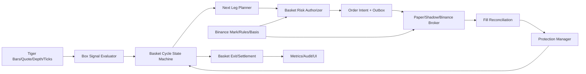

# 《马丁 TP4》策略接入 QuantDesk 升级方案

> 日期：2026-09-01
> 状态：开发中；P0 数据与领域基础已完成，交易执行尚未启用
> 前置分析：`docs/MQ4_MARTINGALE_TP4_STRATEGY_ADAPTATION_ANALYSIS_2026-09-01.md`
> 设计原则：完整参数化、老虎行情驱动、Binance 执行、研究语义可复现、实盘风险独立约束、先回测后 Shadow、最后 Canary

> 数据源决策：策略信号、箱体、ATR、实时现货和美股盘口统一使用老虎证券接口；Binance 只作为合约执行、成交、持仓、标记价格、合约规则和风险保护的数据源。系统不得在老虎数据异常时静默改用 Binance K 线继续产生策略信号。

## 实施状态（2026-09-02）

已完成：

- `martingale_tp4` 完整参数模型、交叉校验和风险预览；
- 老虎官方 OpenAPI 历史 K 线与交易日历适配、分页回填、质量报告和数据集哈希；
- 老虎标的、证券主数据和 Binance 股票合约的核验映射；
- Tiger/Binance 新开仓与加仓基差门禁；减仓、止损和强制退出不受行情门禁阻塞；
- 多腿篮子状态机、腿与事件持久化模型；
- 数据库迁移、配置校验、只读验证 API 和管理员历史数据回填 API；
- 单元、策略 API 和前端路由回归测试。

仍未启用：

- 多腿回测撮合、Shadow、模拟盘和 Binance 实盘执行；
- 未通过样本外回测、重启恢复和故障注入前，不允许发布 Canary 实盘。

## 1. 升级目标

把当前 QuantDesk 从“单次信号 + 单仓位开平仓”升级为可运行有状态、多腿、可恢复的篮子策略平台，使《马丁 TP4》的三种模式能够被配置、回测、Shadow、模拟和受控实盘运行。

升级不是把 MQ4 默认参数写死，也不是把 MQL4 逐行翻译成 Python。目标分为两层：

### 1.1 原策略兼容层

- 支持 `auto`、`recovery`、`grid` 三种模式；
- 支持原策略参数的完整保存和不可变修订；
- 支持箱体、分层仓位、动态 TP、金额止损、追踪、Overlap 和交易时段；
- 支持原版参数组合的历史回放；
- 回放结果明确标记数据精度：K 线近似或 tick 级重放。
- 支持每个 Binance 股票合约关联一个经过核验的老虎美股标的；
- 信号来源与执行来源分开审计，任何订单都能追溯到老虎数据版本和当时的 Binance 基差快照。

### 1.2 生产安全层

- 不修改研究策略语义，但在实盘发布时增加账户级和篮子级硬风险边界；
- 用户仍可配置参数，系统负责判断该参数组合是否允许进入 Shadow、模拟或实盘；
- 风险边界独立于策略源码，策略不能自行关闭或绕过；
- 高点差可以阻止新开/加仓，但不能阻止止损、减仓和强制清仓；
- 进程重启、网络中断、重复事件和成交未知都不能产生重复腿或裸仓。

## 2. 最终交付范围

| 交付项 | 本次升级是否包含 |
|---|---|
| 完整参数配置、校验、版本管理 | 包含 |
| 老虎 M15 箱体 + 老虎 D1 ATR(30) | 包含 |
| 老虎实时行情、盘口与历史 K 线采集 | 包含 |
| Tiger 标的与 Binance 合约映射 | 包含 |
| Tiger/Binance 基差门禁 | 包含 |
| 多腿篮子回测 | 包含 |
| grid 模式 | 第一批包含 |
| recovery 模式 | 第二批包含 |
| auto 模式 | 第二批包含 |
| Shadow 和模拟盘 | 包含 |
| 实盘 Canary | 通过前置验证后包含 |
| 直接无验证全量实盘 | 不包含 |
| 将 AI 评分强行加入原策略 | 不包含 |
| 原 MQ4 图表缩放 `Section` 判断 | 不移植，改为确定性参数 |

## 3. 总体架构



边界保持如下：

- 信号计算只依赖不可变市场数据和策略参数；
- Tiger 是信号事实源，Binance 是执行事实源；
- 篮子状态机只决定状态和下一动作，不直接调用 Binance；
- 风控是独立审批器，不能由策略输出覆盖；
- Broker Adapter 负责交易所差异；
- 数据库事件和订单意图先落库，再产生外部副作用；
- 页面只展示和提交命令，不参与交易计算。

## 4. 参数模型升级

### 4.1 新策略类型

在现有 `builtin_strategy`、`source_strategy`、`full_strategy` 之外新增：

```text
strategy_kind = basket_strategy
engine_key    = martingale_tp4
schema_version = 1
```

策略修订继续使用现有 `strategy_revisions.snapshot_json` 保存完整不可变快照，部署继续绑定固定修订 ID。

### 4.2 建议配置结构

```json
{
  "schema_version": 1,
  "strategy_kind": "basket_strategy",
  "engine_key": "martingale_tp4",
  "market": "BINANCE_TRADIFI_PERPETUAL",
  "market_data": {
    "signal_source": "tiger",
    "underlying_symbol": "AMD",
    "trade_sessions": ["regular"],
    "adjustment": "none",
    "execution_source": "binance",
    "contract_symbol": "AMDUSDT",
    "maximum_tiger_age_seconds": 15,
    "maximum_basis_bps": 100
  },
  "parameters": {
    "mode": "grid",
    "new_cycle": true,
    "sizing": {
      "method": "fixed_quantity",
      "initial_value": 0.01,
      "balance_unit": 10000,
      "multiplier": 2.0,
      "max_leg_quantity": 100,
      "max_legs": 16
    },
    "ladder": {
      "distance_method": "tick_multiple",
      "distance_value": 150,
      "grid_drift_leg": 100
    },
    "take_profit": {
      "method": "tick_multiple",
      "tiers": [
        {"min_legs": 1, "value": 100},
        {"min_legs": 2, "value": 80},
        {"min_legs": 5, "value": 50},
        {"min_legs": 7, "value": 30}
      ]
    },
    "stop": {
      "basket_loss_amount": 0,
      "catastrophe_stop_pct": null
    },
    "trailing": {
      "enabled": false,
      "start": 600,
      "distance": 100
    },
    "overlap": {
      "enabled": true,
      "min_legs": 7,
      "coverage_percent": 111
    },
    "session": {
      "timezone": "UTC",
      "start_hour": 1,
      "end_hour": 23
    },
    "box": {
      "timeframe": "15m",
      "minimum_bars": 22,
      "range_method": "daily_atr",
      "daily_atr_period": 30,
      "daily_atr_factor": 0.2,
      "buffer_method": "tick_multiple",
      "buffer_value": 5
    }
  },
  "live_risk": {
    "max_cycle_loss_pct": 1.0,
    "max_cycle_margin_pct": 10.0,
    "max_cycle_notional": null,
    "minimum_liquidation_buffer_pct": 8.0,
    "daily_loss_limit_pct": 3.0,
    "additions_enabled": true
  }
}
```

这里的数值是结构示例，不是新的固定默认值。最终表单应读取参数 Schema 生成。

### 4.3 配置转换规则

MQ4 参数不能直接按原数值发送 Binance：

| MQ4 概念 | QuantDesk 标准化 |
|---|---|
| Lot | 数量、名义价值或权益比例三种 sizing method |
| Point/Pip | tick multiple、bps 或 ATR multiple |
| MaxSpred | spread bps 或最大滑点 bps |
| SL_Dollar | 篮子货币损失上限 |
| Broker Hour | 显式 IANA 时区 + 小时 |
| Magic | 由 deployment/cycle/leg 幂等键替代 |
| Section | 删除图表依赖，改成 `box_width_atr` 或 `range_bps` |

### 4.4 联合校验

保存策略修订时执行静态校验：

- `max_legs >= 1`；
- `multiplier > 0`；
- TP 层级的 `min_legs` 递增且不超过 `max_legs`；
- `overlap.min_legs <= max_legs`；
- `grid_drift_leg <= max_legs`，或明确关闭模式切换；
- 追踪启用时 start/distance 组合必须实际可触发；
- start/end hour 与时区有效；
- `underlying_symbol` 与 `contract_symbol` 必须存在已核验映射；
- Tiger 行情权限、交易时段和复权口径必须明确；
- Tiger 数据过期、缺失或基差超过阈值时不得开新周期或加仓；
- recovery/auto 部署到实盘时必须使用 Hedge Mode；
- `SL_Dollar=0` 可用于研究，但实盘必须配置灾难止损或获批的等价保护；
- 计算出的最大数量不能超出 Binance 规则。

### 4.5 参数组合风险预览

保存和发布前实时计算：

```text
逐腿数量序列
最大累计数量
最大毛名义价值
预计峰值保证金
最坏配置损失
距离强平线的压力估计
手续费与资金费率压力估计
```

风险预览必须展示计算公式和所用账户权益/价格，不能只显示“高/中/低”。

## 5. 数据层升级

### 5.1 当前老虎接入现状

当前代码 `tiger_quotes.py` 已有：

- Tiger 美股实时简报批量查询；
- 盘前、盘中、盘后候选报价的新鲜度选择；
- Tiger Level-2 买卖盘；
- best bid、best ask、mid、spread、深度和 imbalance；
- 秒级缓存、超时、权限、限流和上游错误分类。

当前缺少：

- Tiger 历史 K 线客户端；
- K 线分页和历史回补；
- Tiger 交易日历/市场状态；
- Tiger 逐笔成交历史和订阅归档；
- Tiger 数据的持久化质量清单；
- Tiger/Binance 标的映射与基差时间序列。

因此不需要重写现有实时报价和盘口客户端，应在其旁边新增历史数据与统一仓储。

### 5.2 P0：新增 Tiger Historical Bars

老虎官方 Open API 的 `QuoteClient.get_bars` 和 `get_bars_by_page` 支持美股日线及 1/5/15/30/60 分钟 K 线；单次请求有数量限制，长区间应分页获取。官方文档：

- [Tiger Open API - Stocks / get_bars](https://quant.itigerup.com/openapi/en/python/operation/quotation/stock.html)
- [Tiger Open API - Quote APIs](https://quant.itigerup.com/openapi/en/python/operation/quotation/quoteList.html)

新增：

```text
TigerBarClient
TigerBarBackfillService
TigerTradingCalendarClient
TigerMarketDataRepository
```

首期采集：

- `15m`：BoxLength 和突破研究；
- `1d`：ATR(30)；
- `1m` 或 `5m`：回测盘中穿越和近似成交顺序；
- 交易日历和市场状态：识别 regular/pre/post/overnight。

参数必须明确 `trade_sessions`，不能把盘前、盘中、盘后和夜盘 K 线无标记地混为一个序列。

### 5.3 P0：新增独立参考行情表

不把 Tiger 现货 K 线伪装成 Binance 合约 K 线。建议新增：

```text
reference_market_bars
```

主键/唯一键包含：

```text
(source, asset_class, symbol, timeframe, trade_session, adjustment, open_time)
```

字段至少包括：

- source=`tiger`；
- symbol=`AMD` 等美股代码；
- timeframe；
- trade_session；
- adjustment；
- open_time/close_time；
- OHLCV/amount；
- received_at；
- source_version。

这样可以从数据层阻止 Tiger 现货和 Binance 合约因代码相似而被混查。

### 5.4 P0：标的映射

在现有证券主数据库上补强映射：

```text
Tiger underlying: AMD
Binance contract: AMDUSDT
relationship: underlying_reference
status: verified
effective_from/effective_to
```

每个映射保存：

- Tiger 代码；
- Binance 合约代码；
- 资产类型；
- 交易币种；
- 交易时区；
- 当前状态；
- 核验来源和时间；
- 公司行动/代码变更状态。

未核验映射不能产生订单。

### 5.5 P0：数据质量清单

新增每个 Tiger `symbol/timeframe/session` 的质量结果：

- expected/actual bars；
- gap count；
- duplicate count；
- invalid OHLC count；
- newest closed time；
- age seconds；
- completeness ratio；
- quote permission；
- regular/pre/post/overnight 覆盖；
- usable/blocked 状态和原因。

策略评估必须读取质量结果。Tiger 数据不合格时返回 `SKIP`，不能静默改用 Binance 信号数据，也不能用最后一条老数据冒充实时数据。

### 5.6 P0：Tiger/Binance 基差门禁

Tiger 是股票现货参考，真实订单成交于 Binance 合约。二者价格不能直接视为相同。

每次开新周期或加仓前冻结：

```text
tiger_bid/tiger_ask/tiger_mid/timestamp
binance_bid/binance_ask/mark/timestamp
basis_bps = (binance_mark / tiger_mid - 1) * 10000
```

规则：

- 任一来源过期：禁止开仓和加仓；
- 基差绝对值超过配置阈值：禁止开仓和加仓；
- 时间戳差超过阈值：禁止开仓和加仓；
- Tiger 负责箱体突破方向；
- Binance 负责最终数量、成交价、保证金、止盈止损和强平风险；
- 退出和减仓不能因 Tiger 中断或基差异常被阻止。

### 5.7 P1：Tiger 逐笔/盘口回放

分两级支持：

#### `bar_approximation`

- 第一阶段使用 Tiger 1m/5m/15m OHLC；
- 采用保守的同 K 线触发顺序；
- Binance 成交成本使用独立的基差、点差和滑点模型；
- 报告明确不是 MQ4 tick 级复刻。

#### `tick_replay`

- 使用 Tiger `get_trade_ticks` 或行情订阅归档逐笔；
- 保存 Tiger best bid/ask、depth、trade 和时间戳；
- 同期保存 Binance mark/bid/ask 的配对快照；
- 使用压缩 Parquet/对象存储保存高频历史；
- MySQL 只保存数据清单、版本、质量和文件校验值；
- 支持回放 Tiger 边界穿越以及 Binance 可执行价格变化。

老虎官方 API 还提供行情权限、K 线额度和盘口接口；系统启动时必须主动检查权限，而不是等策略运行后才发现无权取数。

### 5.8 P1：Binance 执行规则历史

虽然策略数据使用 Tiger，真实下单仍必须保存 Binance 合约规则快照：

- tickSize；
- stepSize；
- minQty/maxQty；
- minNotional；
- 风险档位和最大杠杆；
- 生效时间和数据版本。

Tiger 只决定参考信号，不能替代 Binance 的下单规则、持仓和成交事实。

## 6. 数据库升级

### 6.1 `strategy_basket_cycles`

记录一个品种的一次完整篮子生命周期：

- `public_id`；
- `user_id/deployment_id/strategy_revision_id`；
- `symbol/mode/cycle_seq`；
- `state`；
- `box_high/box_low/box_time`；
- `gross_quantity/net_quantity`；
- `weighted_cost/realized_pnl/unrealized_pnl`；
- `reserved_risk/max_risk`；
- `active_key`；
- `version`；
- `opened_at/closed_at/updated_at`。

`active_key` 在活动周期中使用 `deployment:symbol`，结束后置空；通过唯一索引保证同一部署同一品种只有一个活动篮子。

### 6.2 `strategy_basket_legs`

每次开仓、加仓、对冲和部分退出均记录为一腿：

- `cycle_id/leg_index/action`；
- `direction/position_side`；
- `planned_quantity/filled_quantity`；
- `trigger_price/planned_price/average_fill_price`；
- `intent_id/exchange_order_id/client_order_id`；
- `fee/funding/realized_pnl`；
- `state/reason_code`；
- `created_at/submitted_at/filled_at`。

唯一约束：

```text
(cycle_id, leg_index, action)
client_order_id
```

### 6.3 `strategy_basket_events`

不可变事件账本：

- signal observed；
- risk approved/rejected；
- leg planned/submitted/filled；
- protection installed/failed；
- reconciliation started/completed；
- exit requested/completed；
- operator command；
- recovery/fault event。

业务查询使用 cycle/leg 表，审计和恢复使用 event 表；事件不允许更新覆盖。

### 6.4 `strategy_market_data_manifests`

保存 Tiger K 线/逐笔/盘口与同期 Binance 执行行情文件的数据版本、路径、时间范围、行数、质量、SHA-256 和创建时间，确保回测可重复。

### 6.5 迁移原则

- 新表新增，不破坏现有单仓策略；
- 所有表带 `user_id` 并维持租户级外键一致性；
- 金额、数量、价格使用 Decimal；
- 大型事件详情允许 JSON，但状态、金额、时间和查询字段必须结构化；
- 迁移可回滚；
- 上线前使用生产数据副本验证索引和锁行为。

## 7. 多腿回测引擎

### 7.1 新建 `BasketBacktestEngine`

不要修改现有单仓 `_run_engine` 去兼容所有情况。新增独立的事件驱动引擎，复用 K 线读取、报告存储和策略修订体系。

回测输入明确分层：

- 信号、箱体、ATR 和盘中穿越：Tiger；
- 下单规则、成交成本、保证金、资金费率和强平：Binance 历史规则/配对执行行情；
- 若缺少同期 Binance 配对行情，只能运行研究回放，不能生成实盘发布证据。

核心状态：

```text
AccountState
BasketCycleState
LegState[]
PendingOrder[]
ProtectionState
MarketClock
```

### 7.2 必须支持的行为

- 同品种多腿；
- one-way 和 hedge；
- 同向加仓和反向恢复；
- 每腿单独手续费和滑点；
- 部分成交；
- 动态加权成本；
- 分层 TP；
- 金额止损；
- 追踪退出；
- Overlap 首尾对消；
- 资金费率；
- 保证金、维持保证金和强平；
- 点差阻止开仓/加仓但不阻止退出；
- 期末未关闭篮子单独报告，不能强行算成普通已完成交易。

### 7.3 原版与生产版分开验证

| 配置集 | 用途 | 是否允许实盘 |
|---|---|---|
| `mq4_original_compatible` | 验证原策略语义和尾部风险 | 否 |
| `bounded_grid_v1` | 第一批 Shadow/模拟候选 | 通过审批后 |
| `bounded_recovery_v1` | 第二批 Hedge 候选 | 通过审批后 |
| `bounded_auto_v1` | 第二批自动箱体候选 | 通过审批后 |

用户自定义配置产生新的不可变修订，不覆盖上述基线。

### 7.4 回测报告

至少输出：

- 完成篮子数和未完成篮子数；
- 净收益、最大回撤、Calmar；
- 最大单篮子亏损；
- 95%/99% VaR、CVaR；
- 最大层数分布；
- 最大毛/净敞口；
- 最大保证金占用；
- 最小强平缓冲；
- 费用、资金费率、点差和滑点贡献；
- 按品种、模式、市场环境分桶；
- 参数敏感性；
- 原版与安全版差异。

## 8. 篮子运行时

### 8.1 状态机

```text
arming
  -> opening
  -> open
  -> adding
  -> open
  -> exiting
  -> closed

任意活动状态
  -> recovery_required
  -> exiting 或 open

无法确认的异常
  -> failed_closed
```

`failed_closed` 含义是禁止新增风险，只允许对账、修复保护、减仓或清仓，不是立即删除状态。

### 8.2 每腿执行事务

1. 锁定 account + symbol；
2. 读取交易所账户快照；
3. 对账已有 intent/order/fill；
4. 计算下一腿；
5. 执行篮子风险审批；
6. 写入 leg、risk reservation、outbox；
7. 提交 Broker；
8. 核验成交；
9. 确认账户快照已反映；
10. 安装或调整保护；
11. 提交状态并释放下一腿权限。

任何一步不确定都不得直接进入下一腿。

### 8.3 幂等键

```text
basket:{deployment_id}:{symbol}:{cycle_seq}:{leg_index}:{action}
```

HTTP 重试、任务重试、进程重启和用户重复点击都必须返回同一动作结果。

### 8.4 并发和重启恢复

- 单账户单品种串行执行；
- 数据库行锁 + 风险预留，不能只使用进程锁；
- 启动时先扫描活动 cycle，再查询 Binance；
- 本地有腿、交易所无仓：进入审计，不自动补单；
- 交易所有仓、本地无腿：纳管或强制人工确认，禁止创建新周期；
- 成交状态 UNKNOWN：保留保护和风险预留，持续对账；
- 只有确认无仓、无挂单、无未决 intent 后才能关闭 cycle。

## 9. 风控升级

### 9.1 配置风控与账户风控分离

#### 策略配置风控

决定策略规则如何计算，例如 multiplier、max legs、TP 和 overlap。

#### 实盘账户风控

独立决定是否允许执行：

- 最大单腿名义价值；
- 最大篮子毛名义价值；
- 最大篮子风险；
- 最大保证金占用；
- 最小强平缓冲；
- 最大活动篮子数；
- 当日亏损上限；
- 总账户名义价值；
- 品种白名单和相关性上限。

策略参数不能覆盖账户风控。

### 9.2 每一腿重新审批

马丁的主要风险来自后续腿，因此不能只审批第一单。每次添加前都要使用“添加后的预计账户状态”审批。

审批上下文同时包含 Tiger 数据新鲜度和 Tiger/Binance 基差；两者只约束新增风险，不阻止退出。

### 9.3 退出优先级

```text
交易所强平风险
> 灾难止损
> 人工强制退出
> 保护缺失退出
> 篮子金额止损
> 篮子 TP/追踪/Overlap
> 新增一腿
```

退出和减仓不受 MaxSpread 阻止。

### 9.4 Kill Switch

提供三层开关：

- 全平台禁止新增篮子；
- 单账户禁止新增/加仓；
- 单篮子冻结增仓并执行退出。

关闭策略部署只停止新周期和新增腿，不应未经确认直接删除或遗忘已有仓位。

## 10. Broker 与保护升级

### 10.1 模式约束

- grid 可使用 one-way；
- recovery/auto 必须使用 Hedge Mode；
- 启动和每次下单前核对 Binance 实际模式；
- 模式变化立即暂停新增风险。

### 10.2 保护模型

使用“双层保护”：

- 交易所侧灾难 STOP_MARKET，防服务失联；
- 服务端篮子规则用于精确 TP、追踪和 Overlap。

当篮子数量改变时，以新成交核验后数量重建保护；旧保护只有在新保护确认存在后才撤销。

### 10.3 数量与价格

- 全部使用 `Decimal`；
- 每腿根据 stepSize 向安全方向量化；
- 校验 minQty/minNotional；
- 平仓数量不得超过交易所持仓；
- Hedge Mode 明确 `positionSide`；
- 所有平仓使用 reduce-only 或等价 close-position 语义。
- Tiger 价格只作为参考信号，订单数量量化、保护价格和盈亏始终以 Binance 成交/标记价格为准。

## 11. API 升级

以下为建议接口，继续挂在现有策略 API 下：

### 配置与预览

```text
POST /api/v2/strategies/basket/validate
POST /api/v2/strategies/basket/risk-preview
POST /api/v2/strategies/basket/backtest
```

### 篮子查询

```text
GET /api/v2/strategies/deployments/{id}/basket-cycles
GET /api/v2/strategies/basket-cycles/{id}
GET /api/v2/strategies/basket-cycles/{id}/events
```

### 操作命令

```text
POST /api/v2/strategies/deployments/{id}/pause-additions
POST /api/v2/strategies/deployments/{id}/resume-additions
POST /api/v2/strategies/basket-cycles/{id}/exit
```

所有写操作要求：权限校验、幂等键、审计日志、乐观版本号和明确响应状态。Router 只处理权限、参数、事务边界和 presenter，不承载策略计算。

## 12. `/strategies` 页面升级

### 12.1 创建/编辑页

按分组展示完整参数：

- 模式；
- 初始仓位；
- 分层和倍数；
- 距离；
- TP/止损/追踪；
- Overlap；
- 箱体；
- 时段；
- 实盘风险边界。
- Tiger 标的、交易时段、复权口径和 Binance 合约映射；
- 最大允许基差和两端行情新鲜度。

必须实时展示：

- 数量序列；
- 最大累计数量；
- 预计名义价值和保证金；
- 参数关系错误；
- 当前配置允许的最高部署阶段。
- Tiger 行情权限、K 线覆盖和当前基差状态。

### 12.2 版本详情

- 完整参数快照；
- 与上一版本的差异；
- 数据要求；
- 风险预览；
- 回测/Shadow/模拟/实盘验证记录；
- 当前是否可发布及阻塞原因。

### 12.3 部署详情

- 当前活动篮子；
- 每一腿计划与成交；
- 毛/净敞口；
- 加权成本；
- 目标、止损和保护状态；
- 下一腿触发条件；
- 当前风险占用；
- 对账和异常；
- Tiger 信号快照、Binance 执行快照和基差；
- 暂停增仓、恢复和退出按钮。

### 12.4 回测页

从“交易列表”升级为“篮子列表 + 腿明细”，重点展示最大层数、单篮子损失、保证金峰值和未完成篮子。

## 13. 验证与测试

### 13.1 MQ4 黄金用例

从源码固定一组小场景：

- 箱体上破/下破；
- 没有穿越不触发；
- grid 逆向补仓；
- recovery 上下沿交替；
- 数量倍增与 MaxLot 截断；
- TP 阶梯切换；
- 金额止损；
- 追踪启动；
- Overlap 首尾关闭；
- 时间窗口；
- MaxOrders；
- 高点差不允许新增，但仍允许退出。

### 13.2 单元测试

- 参数解析与联合校验；
- Decimal 数量量化；
- 箱体和 ATR 因果性；
- 下一腿计划；
- 加权成本和净敞口；
- 风险预览；
- 状态机转换；
- 幂等键。

### 13.3 属性测试

- 增加层数不能降低最大毛敞口；
- multiplier 增加不能降低预计最大风险；
- 退出动作永远不增加风险；
- 同一事件重复任意次结果不变；
- 任意中断点重启后不会重复腿；
- 任何状态下已成交数量都能追溯到 leg/event。

### 13.4 集成测试

- MySQL 行锁与并发；
- 重启恢复；
- 部分成交；
- 提交后超时；
- crash before ack；
- 网络断开；
- 保护安装失败；
- Binance 持仓模式改变；
- 规则改变；
- 外部人工仓位冲突。
- Tiger 权限缺失、限流、超时和过期行情；
- Tiger/Binance 代码映射失效；
- 两端时钟偏差和基差超限；
- Tiger 中断时禁止新增风险但仍能 Binance 减仓。

### 13.5 前端测试

- 参数表单和错误提示；
- 风险预览；
- 版本差异；
- 篮子/腿详情；
- 操作按钮权限和二次确认；
- SSE 更新按 cycle/leg 合并；
- 视觉回归和窄屏可用性。

## 14. 分阶段实施计划

| 阶段 | 开发内容 | 预计开发量 | 退出门槛 |
|---|---|---:|---|
| P0-0 | 语义规范、参数 Schema、黄金用例 | 2～3 天 | 参数可完整往返，原策略行为无歧义 |
| P0-1 | Tiger Bars/日线、标的映射、质量与基差门禁 | 5～8 天 | Tiger 数据合格，可复现 ATR(30)，映射与基差可审计 |
| P0-2 | 多腿篮子回测器 | 7～10 天 | 原版/安全版均可回放，报告完整 |
| P1-1 | cycle/leg/event、状态机、幂等、恢复 | 7～10 天 | 故障注入无重复腿、无状态丢失 |
| P1-2 | `/strategies` 配置、详情、回测 UI | 5～7 天 | 可创建修订、预览风险、查看篮子 |
| P1-3 | Shadow + 模拟盘 Broker | 5～7 天 | 与回放一致，订单/保护事故为 0 |
| P2-1 | grid 微型实盘 Canary | 开发 3～5 天 + 观察期 | 通过 micro_live 和 fault_drill |
| P2-2 | recovery/auto | 5～8 天 + 独立验证 | Hedge 语义、净敞口和保护全部通过 |

开发工作量预计约 **5～7 周**；验证观察期不与开发时间混为一谈：

- Shadow 按现有发布门槛不少于 28 天；
- 模拟盘不少于 100 个完成篮子；
- 微型实盘不少于 28 天或达到审批样本数；
- 任何执行级事故都会重置相应观察窗口。

## 15. 发布门槛

### 15.1 Backtest Gate

- 样本外扣费后结果满足审批要求；
- 双倍成本压力下仍通过；
- 参数邻域稳定；
- 最大回撤和单篮子亏损在限制内；
- 没有强平；
- 收益不由单一品种主导；
- 数据质量报告完整。
- Tiger 数据来源、权限、时段、复权口径和版本完整；
- Tiger 信号与 Binance 执行成本没有使用未来基差数据。

### 15.2 Shadow Gate

- 不少于 28 天；
- 实时与回放决策一致率 ≥99.9%；
- 延迟满足 SLO；
- incident_count = 0；
- 无重复腿、无状态漂移、无未解释跳步。
- Tiger 数据异常和基差超限均能正确阻止新增风险；
- Tiger 中断不影响已有 Binance 仓位的保护和退出。

### 15.3 Paper Gate

- 不少于 100 个完成篮子；
- 扣费后结果为正；
- 模拟滑点不优于压力模型；
- 订单、保护和恢复事故为 0。

### 15.4 Micro-live Gate

- 只允许一个账户、少量高流动性品种；
- 首期只启用 grid；
- 配置最大 3～5 腿的生产模板；
- 极低账户风险预算；
- 实际成交与 Shadow 偏差在阈值内；
- 无重复订单、裸仓、未纳管仓位；
- 达到 28 天或审批样本数。

## 16. 上线与回滚

### 16.1 Feature Flags

```text
BASKET_STRATEGY_ENABLED
BASKET_SHADOW_ENABLED
BASKET_PAPER_ENABLED
BASKET_LIVE_ENABLED
BASKET_RECOVERY_AUTO_ENABLED
```

默认只开启配置、回测和 Shadow。

### 16.2 监控指标

- active cycles；
- pending/unknown legs；
- reconciliation age；
- unprotected exposure；
- risk reservation drift；
- duplicate intent attempts；
- market data age/gaps；
- Tiger quote/bar/depth permission and age；
- Tiger/Binance basis bps and clock skew；
- broker error rate；
- cycle PnL/drawdown；
- liquidation buffer。

### 16.3 回滚原则

- 关闭功能开关只阻止新增风险；
- 已有篮子继续由恢复/退出服务纳管；
- 不回滚已执行的数据库事件；
- 不删除腿或重写成交历史；
- 必要时启用“冻结增仓 + 统一减仓/退出”；
- 新表与旧单仓策略隔离，回滚不影响原策略运行。

## 17. 建议的第一期开发边界

为了最快建立正确基础，第一期只做：

1. 完整参数 Schema 和风险预览；
2. Tiger 15m/1d 数据、标的映射、数据质量和基差门禁；
3. 多腿回测；
4. cycle/leg/event 持久化；
5. `grid` 状态机；
6. Shadow 和模拟盘；
7. `/strategies` 的参数、回测、篮子详情。

第一期不做：

- recovery/auto 实盘；
- 无灾难保护的实盘；
- 16 层默认参数直接发布；
- 使用 AI 评分替换箱体信号；
- 用现有单仓回测结果冒充篮子策略验证。

## 18. 开发启动条件

开始编码前需要冻结以下决策：

- 第一批是否只做 grid：建议是；
- 距离标准化是否同时支持 tick/bps/ATR：建议全部支持；
- Tiger 历史 K 线使用官方 Open API，现有实时简报/盘口客户端继续复用；
- Tiger/Binance 标的映射以证券主数据库为准；
- Tiger 交易时段：建议首期 regular，盘前/盘后/overnight 作为显式可选项；
- Tiger 复权口径：建议回测固定并写入修订，实盘信号保持同一口径；
- Tiger/Binance 最大基差阈值由管理员设置硬上限；
- 高频历史存储位置：建议压缩 Parquet + manifest；
- 原版无硬止损是否只允许研究：建议是；
- 实盘初始最大腿数：建议 3～5；
- 使用 one-way 还是 hedge：grid 首期 one-way，后续 recovery/auto hedge；
- 账户级风险上限由管理员还是用户设置：建议管理员设硬上限，用户只能在其内调整。

上述决策冻结后，按 P0-0 → P0-1 → P0-2 顺序开发，不先接真实订单。
