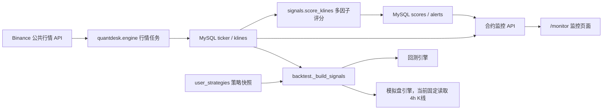
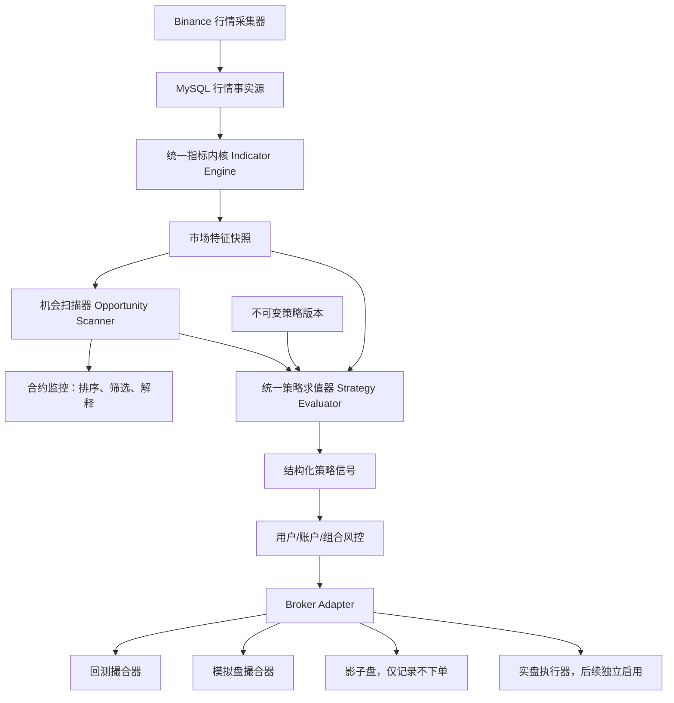

# QuantDesk 策略中心重构开发方案

> 文档状态：讨论稿，不代表已经进入编码阶段  
> 编制日期：2026-08-04  
> 适用范围：Binance TradFi 永续合约、合约监控、指标计算、机会发现、回测、模拟盘，以及后续实盘策略部署  
> 本轮约束：先确认方案，再开发；本文不授权自动实盘下单

## 1. 文档目标

当前策略中心把“技术指标信号模板”包装成了“策略”，导致策略名称、实际计算逻辑和执行能力不一致。本方案用于明确以下问题：

1. 合约监控、行情数据、指标、机会和策略之间的真实关系。
2. 什么是指标，什么是机会，什么才是可回测、可模拟、可执行的完整策略。
3. 策略中心应当提供哪些页面、配置能力、状态和验证流程。
4. 后端需要怎样的统一策略引擎、数据结构、API 和多用户隔离。
5. 如何在不破坏现有模拟盘和历史数据的前提下分阶段重构。

## 2. 核心结论

### 2.1 是否基于合约监控获取数据源并发现机会

业务理解基本正确，但技术表述需要修正：

- 合约监控不是行情数据源，它是行情与指标结果的展示和机会观察入口。
- 真正的数据源是 Binance 公共行情接口。
- 后台行情引擎负责采集实时价格、24 小时统计和已收盘 K 线，并写入 MySQL。
- 合约监控读取 MySQL 中的 `ticker`、`klines`、`scores`、`alerts` 等数据。
- 当前模拟盘不读取合约监控页面的综合评分，而是直接读取同一份 `klines`，再调用回测模块中的简化信号函数。
- 当前策略中心只保存策略名称、5 种固定引擎之一、少量参数和风险默认值；它没有形成完整的机会确认、入场、退出和执行定义。

因此，目标架构应当是：合约监控和策略运行共享同一份行情与指标事实源，但策略不能依赖某个前端页面，也不能把监控评分直接等同于交易指令。

### 2.2 本次重构的关键原则

1. 指标只描述市场，不直接代表完整策略。
2. 机会是值得进一步评估的市场状态，不等于允许下单。
3. 策略必须完整定义适用市场、周期、过滤条件、入场、退出、仓位、风控和执行语义。
4. 回测、模拟盘和后续实盘必须使用同一个策略求值器，只替换行情回放器和 Broker 适配器。
5. 只使用已收盘 K 线产生策略信号，杜绝未来函数和未收盘 K 线漂移。
6. 策略版本一经部署必须不可变；修改策略只能产生新版本。
7. 行情和标准指标可以全局共享；策略、部署、信号、提醒、模拟盘和实盘状态必须按 `user_id` 隔离。
8. 策略 DSL 只允许受约束的结构化规则，不执行用户或 AI 生成的任意 Python、SQL 或 JavaScript。

## 3. 当前系统现状审计

### 3.1 当前数据链路



代码事实：

- `src/quantdesk/engine.py` 采集 ticker 和 K 线，并触发多因子评分。
- `src/quantdesk/signals.py` 计算 MA、MACD、SuperTrend、RSI、布林带、OBV、成交量和 ATR 因子评分。
- `src/quantdesk_v2/monitor.py` 读取 MySQL 并为合约监控页面提供聚合数据。
- `src/quantdesk_v2/strategy_catalog.py` 维护系统模板和用户策略参数。
- `src/quantdesk_v2/backtest.py` 只有 5 种简化信号引擎。
- `src/quantdesk/paper.py` 读取策略快照，但行情周期目前硬编码为 `4h`，并复用 `_build_signals`。

### 3.2 当前“策略中心”实际保存的内容

当前系统有 19 个策略模板名称，但只映射到以下 5 个引擎：

| 引擎 | 实际信号逻辑 | 当前模板数量 | 本质 |
| --- | --- | ---: | --- |
| `ma_cross` | 快慢均线交叉 | 4 | 单一趋势信号 |
| `macd_momentum` | MACD 柱穿越零轴 | 4 | 单一动量信号 |
| `rsi_reversal` | RSI 离开超买/超卖区 | 4 | 单一反转信号 |
| `bollinger_reversion` | 价格从布林带外回到带内 | 2 | 单一均值回归信号 |
| `multi_factor` | MA、MACD、RSI、布林带简单打分 | 5 | 简化组合信号 |

当前存在明显的名称与实现不一致：

- “MACD 金叉放量”没有真正执行成交量条件。
- “量价齐升”没有完整的量价结构判断。
- “强势高开”没有开盘缺口数据和交易时段语义。
- “连板股、连板接力、逼近涨停”等股票概念不适合 Binance 永续合约，也没有对应实现。
- “低波动龙头”没有龙头筛选、横截面排名和流动性定义。
- “趋势突破”没有结构高点、突破确认、回踩确认和假突破退出。

这些模板可以作为指标演示或历史兼容项，但不能继续作为“可执行策略”对用户展示。

### 3.3 当前模型缺失的策略要素

当前 `user_strategies` 主要包含 `engine_key`、`parameters_json` 和 `risk_defaults_json`，尚未明确保存：

- 交易市场与合约范围。
- 主周期、确认周期和执行周期。
- 市场状态过滤，例如趋势、震荡、高波动和低流动性。
- 机会形成、确认和失效条件。
- 多头和空头是否分别启用。
- 入场订单类型、价格容忍度和信号有效期。
- 分批入场、加仓和减仓规则。
- ATR、结构位、跟踪止损、时间止损和策略失效退出。
- 单笔风险、组合风险、相关性和最大同时持仓。
- 冷却期、重复信号去重和异常暂停。
- 策略部署状态，以及一个策略版本被哪些模拟盘/实盘实例使用。

### 3.4 当前最重要的技术不一致

合约监控的多因子评分和回测/模拟盘的 `multi_factor` 不是同一套实现：

- 监控评分包含 SuperTrend、OBV、成交量和 ATR 状态。
- 回测的 `multi_factor` 只包含 MA、MACD、RSI 和布林带简化投票。
- 相同名称在监控、回测和模拟盘中可能产生不同方向。

重构时必须先统一指标内核和信号语义，否则策略中心做得再完整，也无法保证回测与运行一致。

## 4. 领域概念与严格边界

| 概念 | 定义 | 是否可直接下单 | 示例 |
| --- | --- | --- | --- |
| 行情数据 | 交易所提供的价格、OHLCV、成交额等原始事实 | 否 | 15m 已收盘 K 线 |
| 指标 | 对行情的确定性数学变换 | 否 | RSI=28、ATR%=1.8 |
| 因子 | 把一个或多个指标转成可比较的特征或倾向 | 否 | 趋势因子=+0.7 |
| 市场状态 | 对趋势、震荡、波动和流动性的分类 | 否 | 4h 上升趋势、中波动 |
| 机会 | 满足扫描条件、值得策略继续评估的候选事件 | 否 | 1h 回踩 EMA20 后恢复 |
| 策略 | 对机会进行过滤，并完整定义入场、退出、风险和执行 | 是，但必须经过部署和风控 | 多周期趋势回踩延续 |
| 策略版本 | 某次发布后不可变的完整策略快照 | 否 | Strategy A v3 |
| 部署实例 | 某用户把某策略版本绑定到回测、模拟盘、影子盘或实盘 | 取决于模式 | 模拟盘 2 绑定 v3 |
| 策略信号 | 策略求值器在指定时间生成的结构化交易意图 | 尚不能直接成交 | LONG_ENTRY，置信度 0.78 |
| 风控决策 | 对信号进行账户级、组合级和交易级审批 | 是/否 | 拒绝：当日亏损超限 |
| 订单意图 | 通过全部风控后的幂等下单请求 | 是 | 限价开多 BTCUSDT |

## 5. 目标总体架构



### 5.1 共享与多用户边界

全局共享：

- 合约清单和交易规则。
- ticker、K 线、资金费率、持仓量等公共行情。
- 标准指标定义。
- 相同参数哈希下的市场特征快照。
- 不含用户偏好的公共机会候选。

必须带 `user_id`：

- 用户策略、策略修订和草稿。
- 策略部署实例。
- 策略信号及其审批状态。
- 用户机会订阅、提醒和已读状态。
- 模拟盘、影子盘、实盘账户状态。
- 订单、成交、持仓、风险状态和绩效。

## 6. 指标中心设计

### 6.1 指标的职责

指标中心负责“计算和解释”，不负责“决定是否交易”。每个指标必须具备：

- 稳定 `indicator_key` 和独立版本号。
- 明确输入字段、参数、输出字段和最少预热 K 线数。
- 确定性实现，相同输入必须产生相同输出。
- 对缺失数据、零成交量、异常价格和未收盘 K 线的处理规则。
- 单元测试、边界测试和参考样本。
- 中文解释模板，但解释不能改变计算结果。
- 参数哈希，便于缓存、审计和复现。

### 6.2 第一阶段指标清单

| 分类 | 指标 | 主要输出 | 用途 | V1 |
| --- | --- | --- | --- | --- |
| 价格 | 收益率/振幅 | `return_pct`、`range_pct` | 异动、波动基础 | 是 |
| 趋势 | SMA/EMA | 数值、斜率、价格距离 | 趋势方向与回踩 | 是 |
| 趋势 | SuperTrend | 方向、趋势线 | 趋势过滤和跟踪退出 | 是 |
| 趋势强度 | ADX/DI | ADX、+DI、-DI | 区分趋势与震荡 | 是，需新增 |
| 动量 | MACD | DIF、DEA、柱体、斜率 | 动量确认 | 是 |
| 动量 | RSI | 数值、分区、斜率 | 强弱、超买超卖 | 是 |
| 波动 | ATR/ATR% | ATR、ATR 占价格比例 | 止损距离与仓位换算 | 是 |
| 波动 | Bollinger | 上中下轨、%B、带宽 | 挤压、突破、均值回归 | 是 |
| 突破 | Donchian | N 期高低点、突破状态 | 结构突破 | 是，需新增 |
| 量价 | 成交量比 | 当前量/均量、量能分位 | 突破确认 | 是 |
| 量价 | OBV | OBV、斜率、背离提示 | 资金流确认 | 是 |
| 市场质量 | 流动性 | 成交额、缺失率、异常跳点 | 禁止低质量信号 | 是 |
| 衍生品 | 资金费率 | 当前值、分位、极端状态 | 拥挤度过滤 | 第二阶段 |
| 衍生品 | 持仓量 OI | 变化率、价格/OI 组合 | 新增资金确认 | 第二阶段 |
| 微观结构 | 买卖价差/深度 | spread、depth imbalance | 执行质量 | 第三阶段 |

### 6.3 指标定义结构

```json
{
  "indicator_key": "ema",
  "version": 1,
  "input": ["close"],
  "parameters": {
    "period": {"type": "integer", "min": 2, "max": 500}
  },
  "outputs": ["value", "slope_pct", "distance_pct"],
  "warmup_bars": "period + 5",
  "closed_bar_only": true,
  "implementation_key": "ema_v1"
}
```

### 6.4 指标计算规则

1. 存储和计算时间统一使用 UTC。
2. 运行策略只读取已收盘 K 线；实时 ticker 仅用于风险监控和成交价格估算。
3. 同一指标的缓存键为：`symbol + timeframe + bar_open_time + indicator_key + version + params_hash`。
4. 数据不足时返回 `unavailable`，不得用零值冒充有效指标。
5. 行情过期、K 线缺口或异常价格必须写入 `quality_json`。
6. 回测按时间顺序增量计算，不能读取未来 K 线。

## 7. 机会发现层设计

### 7.1 合约监控的目标职责

合约监控负责：

- 展示全市场状态和多空分布。
- 按机会质量、流动性、波动和新鲜度排序。
- 展示机会为什么出现、哪些条件已满足、哪些仍待确认。
- 允许用户关注、忽略、订阅或送入某个策略进行验证。

合约监控不负责：

- 直接代表策略入场信号。
- 绕过策略风险配置下单。
- 把综合评分超过阈值等同于“必做多/必做空”。

### 7.2 建议的机会扫描器

| 扫描器 | 作用 | 输出示例 |
| --- | --- | --- |
| 市场倾向扫描 | 延续现有多因子评分，用于全市场排序 | 4h 偏多 68，1h 偏多 55 |
| 趋势回踩扫描 | 找到大周期趋势中回踩关键均线的标的 | 4h 多头，1h 回踩 EMA20 |
| 波动挤压扫描 | 找到布林带宽处于历史低分位的标的 | 带宽分位 8%，等待突破 |
| 结构突破扫描 | 识别 Donchian/前高前低突破候选 | 突破 20 根 K 线高点 |
| 均值回归扫描 | 仅在震荡状态寻找极端偏离 | ADX 低，%B=-0.08，RSI=24 |
| 异动扫描 | 延续 5 分钟急涨急跌提醒 | 5 分钟上涨 2.4% |

### 7.3 机会生命周期

建议状态：

`detected → watching → confirmed → expired/rejected → consumed`

- `detected`：扫描条件首次满足。
- `watching`：形成 setup，但缺少最终触发。
- `confirmed`：满足扫描器确认条件，可交给策略求值。
- `expired`：超过有效 K 线数仍未确认。
- `rejected`：数据质量、流动性或市场状态不合格。
- `consumed`：已经被某部署实例评估并产生信号。

机会必须携带证据快照，不能只保存一句文本说明。

## 8. 真正策略的完整模型

一条可发布策略至少包含以下十部分：

| 模块 | 必须定义的内容 |
| --- | --- |
| 基本信息 | 名称、策略类型、描述、适用市场、风险等级 |
| 交易范围 | 合约集合、白名单/黑名单、最低成交额、最多候选数 |
| 周期结构 | 趋势周期、setup 周期、触发周期、执行周期 |
| 市场状态 | 趋势/震荡/波动过滤，不适用时必须禁止开仓 |
| 指标依赖 | 指标版本、参数、别名、所在周期 |
| 入场规则 | 多空分别定义 setup、trigger、确认和信号有效期 |
| 退出规则 | 止损、止盈、跟踪止损、反转、时间退出、失效退出 |
| 仓位与风险 | 单笔风险、杠杆上限、最大持仓、组合风险、冷却期 |
| 执行规则 | 市价/限价、允许滑点、超时、部分成交、最小订单处理 |
| 提醒与审计 | 产生何种提醒、保存哪些证据、如何去重和解释 |

### 8.1 策略 DSL 建议结构

```json
{
  "schema_version": 1,
  "strategy_type": "trend_pullback_continuation",
  "market": "BINANCE_TRADIFI_PERPETUAL",
  "directions": ["long", "short"],
  "universe": {
    "source": "tradfi_perpetuals",
    "min_quote_volume_24h": 1000000,
    "max_candidates": 20
  },
  "timeframes": {
    "regime": "4h",
    "setup": "1h",
    "trigger": "15m"
  },
  "indicators": [
    {"alias": "ema20_4h", "key": "ema", "version": 1, "timeframe": "4h", "params": {"period": 20}},
    {"alias": "ema50_4h", "key": "ema", "version": 1, "timeframe": "4h", "params": {"period": 50}},
    {"alias": "atr_1h", "key": "atr", "version": 1, "timeframe": "1h", "params": {"period": 14}},
    {"alias": "volume_ratio_15m", "key": "volume_ratio", "version": 1, "timeframe": "15m", "params": {"period": 20}}
  ],
  "regime_filter": {
    "long": {"all": [
      {"op": "gt", "left": "ema20_4h.value", "right": "ema50_4h.value"},
      {"op": "gt", "left": "ema20_4h.slope_pct", "right": 0}
    ]}
  },
  "entry": {
    "long": {
      "setup": {"op": "lte", "left": "price.distance_to_ema20_1h_atr", "right": 0.5},
      "trigger": {"all": [
        {"op": "crosses_above", "left": "close_15m", "right": "recent_high_15m"},
        {"op": "gte", "left": "volume_ratio_15m.value", "right": 1.3}
      ]},
      "valid_for_bars": 2
    }
  },
  "exit": {
    "initial_stop": {"type": "atr", "multiple": 1.5},
    "take_profit": {"type": "risk_reward", "multiple": 2.5},
    "trailing_stop": {"enabled_after_r": 1.0, "type": "supertrend"},
    "time_stop_bars": 48,
    "exit_on_regime_break": true
  },
  "risk": {
    "risk_per_trade_pct": 0.5,
    "max_margin_pct": 10,
    "max_leverage": 5,
    "max_open_positions": 5,
    "max_correlated_positions": 2,
    "daily_loss_limit_pct": 3,
    "cooldown_bars": 4
  },
  "execution": {
    "entry_order": "limit_or_cancel",
    "max_slippage_bps": 8,
    "order_timeout_seconds": 20,
    "signal_on_closed_bar": true
  }
}
```

### 8.2 允许的规则运算符

V1 仅允许经过验证的运算符：

- 逻辑：`all`、`any`、`not`。
- 比较：`gt`、`gte`、`lt`、`lte`、`eq`、`between`。
- 事件：`crosses_above`、`crosses_below`、`changed_to`、`new_high`、`new_low`。
- 序列：`rising_for`、`falling_for`、`true_for`、`within_last_bars`。
- 风险和状态：`position_is_flat`、`cooldown_complete`、`data_is_fresh`。

禁止：任意脚本、动态导入、SQL 表达式、网络请求和未经登记的函数名。

## 9. 首批真正策略建议

### 9.1 V1 推荐：多周期趋势回踩延续

定位：适合 Binance TradFi 永续合约的中低频趋势策略。

- 4h 判断大趋势：EMA20 与 EMA50 排列、斜率、ADX。
- 1h 等待回踩：价格靠近 EMA20 或突破结构位后的回踩区域。
- 15m 触发：重新站上局部高点/低点，并获得成交量确认。
- ATR 换算止损距离和下单数量。
- 初始止损 1.5 ATR，初始目标 2.5R；盈利 1R 后启用跟踪保护。
- 趋势破坏、超时、行情过期或流动性不足时退出/禁止开仓。
- 多头和空头规则分别计算，不能简单把多头条件乘以 `-1`。

选择它作为第一条策略的原因：与现有 15m/1h/4h 数据匹配，能复用 EMA、ATR、成交量和 SuperTrend，又足以验证真正的多周期策略架构。

### 9.2 V1 第二条：波动挤压突破

- 1h Bollinger 带宽进入过去 N 根 K 线低分位。
- 4h 方向过滤或允许双向等待。
- 15m 突破 Donchian 通道，成交量比大于阈值。
- 假突破重新回到区间时快速退出。
- ATR 止损，分批止盈或跟踪退出。

### 9.3 V1 第三条：震荡区间均值回归

- 仅在 ADX 较低且长周期趋势不明显时启用。
- 价格偏离 Bollinger 外轨、RSI 极端且没有放量趋势突破。
- 回到带内后入场，目标为中轨或区间中值。
- 结构继续突破或达到 ATR 止损时退出。
- 高波动和趋势市场必须禁止使用。

## 10. 统一策略运行时

### 10.1 必须共用的核心组件

`StrategyEvaluator` 接收：

- 不可变策略版本。
- 截止到当前已收盘 K 线的市场上下文。
- 当前部署实例状态。
- 当前持仓和账户风险状态。

输出统一的 `StrategyDecision`：

```json
{
  "decision": "LONG_ENTRY",
  "symbol": "BTCUSDT",
  "signal_bar_time": 1785787200000,
  "valid_until": 1785794400000,
  "confidence": 0.78,
  "reason_codes": ["REGIME_UP", "PULLBACK_CONFIRMED", "VOLUME_CONFIRMED"],
  "evidence": {},
  "risk_proposal": {},
  "idempotency_key": "deployment:symbol:strategy_version:bar:decision"
}
```

### 10.2 回测、模拟盘和实盘的边界

| 模式 | 行情输入 | 成交适配器 | 是否真实下单 |
| --- | --- | --- | --- |
| 回测 | 历史 K 线顺序回放 | 历史撮合器 | 否 |
| 模拟盘 | 当前已收盘 K 线 + ticker | 模拟撮合器 | 否 |
| 影子盘 | 实时行情和账户状态 | 只记录订单意图 | 否 |
| 实盘 | 实时行情和账户状态 | Binance Broker Adapter | 是，后续单独授权 |

四种模式必须调用同一个 `StrategyEvaluator`。任何只在模拟盘或只在回测中存在的特殊信号逻辑都视为缺陷。

### 10.3 运行语义

1. 信号只在对应周期 K 线收盘后计算一次。
2. 同一部署、标的、策略版本、K 线和决策必须幂等。
3. 信号产生时间和模拟成交时间必须分离，默认下一可成交价格执行。
4. 行情陈旧、指标缺失、账户状态异常时只能输出 `SKIP`，不能沿用旧信号。
5. 策略状态至少包含 `draft`、`published`、`retired`。
6. 部署状态至少包含 `created`、`running`、`paused`、`stopped`、`error`。
7. 修改已发布策略必须生成新修订；现有部署继续固定旧版本，直到用户明确升级。

## 11. 多模拟盘与策略部署

当前一个用户已经可以创建多个模拟盘，这个方向保留并强化：

- 一个模拟盘就是一个独立的策略部署实例。
- 每个模拟盘固定一个具体策略修订版本，而不是始终读取策略“最新版”。
- 同一策略版本可以被多个模拟盘使用，但资金、持仓、交易和绩效完全隔离。
- 一个用户可以用不同参数、不同周期、不同标的范围创建多个策略版本，再分别绑定模拟盘。
- 策略升级时提供“新建模拟盘验证”和“原模拟盘切换版本”两个动作；切换前必须处理未平仓仓位。
- 模拟盘页面必须展示策略名、版本、周期、市场范围、运行状态和最后一次求值时间。

## 12. 数据库方案

以下为目标模型。所有新增表和字段必须写 MySQL `COMMENT`，并同步更新 `docs/数据库字典.md`。

### 12.1 `market_feature_snapshots`：共享市场特征快照

| 字段 | 类型建议 | 说明/注释 |
| --- | --- | --- |
| `id` | BIGINT PK | 特征快照主键 |
| `symbol` | VARCHAR(32) | 合约代码 |
| `timeframe` | VARCHAR(8) | K 线周期 |
| `bar_open_time` | BIGINT | 对应已收盘 K 线开盘时间 |
| `feature_set_key` | VARCHAR(64) | 标准特征集合标识 |
| `feature_set_version` | INT | 特征集合实现版本 |
| `params_hash` | CHAR(64) | 指标参数规范化 SHA-256 |
| `values_json` | JSON | 指标和派生特征值 |
| `quality_json` | JSON | 缺口、陈旧、异常和可用性信息 |
| `computed_at` | DATETIME | 计算完成时间（UTC） |

唯一键：`symbol + timeframe + bar_open_time + feature_set_key + feature_set_version + params_hash`。

### 12.2 `market_opportunities`：共享机会事件

| 字段 | 类型建议 | 说明/注释 |
| --- | --- | --- |
| `id` | BIGINT PK | 机会事件主键 |
| `public_id` | CHAR(36) | 对外 UUID |
| `scanner_key` | VARCHAR(64) | 机会扫描器标识 |
| `scanner_version` | INT | 扫描器版本 |
| `symbol` | VARCHAR(32) | 合约代码 |
| `primary_timeframe` | VARCHAR(8) | 机会主周期 |
| `direction` | VARCHAR(12) | long、short 或 neutral |
| `status` | VARCHAR(16) | detected、watching、confirmed、expired、rejected |
| `quality_score` | DECIMAL(8,4) | 机会质量分，不代表交易收益概率 |
| `detected_bar_time` | BIGINT | 首次发现的已收盘 K 线时间 |
| `expires_bar_time` | BIGINT | 机会失效时间 |
| `evidence_json` | JSON | 指标证据、条件命中和解释 |
| `dedup_key` | VARCHAR(191) | 机会幂等去重键 |
| `created_at` | DATETIME | 创建时间（UTC） |
| `updated_at` | DATETIME | 最后状态更新时间（UTC） |

### 12.3 现有 `strategy_templates` 调整

新增/调整字段：

| 字段 | 类型建议 | 说明/注释 |
| --- | --- | --- |
| `template_kind` | VARCHAR(24) | `strategy` 或 `legacy_signal` |
| `spec_schema_version` | INT | 策略 DSL 结构版本 |
| `spec_json` | JSON | 完整系统策略定义 |
| `implementation_version` | VARCHAR(32) | 求值器/策略实现版本 |
| `deprecated_at` | DATETIME NULL | 模板停止用于新策略的时间 |

旧 `engine_key`、参数和风险字段先保留用于兼容，最终由 `spec_json` 取代。

### 12.4 现有 `user_strategies` 调整

| 字段 | 类型建议 | 说明/注释 |
| --- | --- | --- |
| `lifecycle_status` | VARCHAR(16) | draft、published、retired |
| `current_draft_revision_id` | BIGINT NULL | 当前可编辑草稿修订 |
| `latest_published_revision_id` | BIGINT NULL | 最新已发布修订 |
| `strategy_type` | VARCHAR(64) | 真正策略类型标识 |
| `risk_level` | VARCHAR(16) | low、medium、high |

`user_id` 继续作为所有查询和数据库外键的租户边界。

### 12.5 现有 `strategy_revisions` 调整

每个修订快照至少包含：

- `spec_schema_version`：DSL 版本。
- `spec_json`：完整策略定义。
- `spec_hash`：规范化策略内容哈希。
- `validation_json`：静态校验、数据依赖和风险提示。
- `published_at`：发布时刻；草稿可为空。

已发布修订不可 UPDATE，只能新增下一版本。

### 12.6 `strategy_deployments`：策略部署实例

| 字段 | 类型建议 | 说明/注释 |
| --- | --- | --- |
| `id` | BIGINT PK | 部署实例主键 |
| `public_id` | CHAR(36) | 对外 UUID |
| `user_id` | BIGINT | 所属用户 ID |
| `strategy_id` | BIGINT | 所属用户策略 ID |
| `strategy_revision_id` | BIGINT | 固定的不可变策略修订 ID |
| `mode` | VARCHAR(16) | backtest、paper、shadow、live |
| `target_account_id` | BIGINT NULL | 模拟盘或实盘账户内部 ID |
| `name` | VARCHAR(100) | 部署显示名称 |
| `status` | VARCHAR(16) | created、running、paused、stopped、error |
| `universe_override_json` | JSON NULL | 部署级交易范围覆盖 |
| `risk_override_json` | JSON NULL | 仅允许收紧的风险覆盖 |
| `runtime_state_json` | JSON | setup、冷却、去重等运行状态 |
| `last_evaluated_bar_time` | BIGINT NULL | 最后求值 K 线时间 |
| `last_error_code` | VARCHAR(64) NULL | 最后脱敏错误代码 |
| `started_at` | DATETIME NULL | 启动时间（UTC） |
| `created_at` | DATETIME | 创建时间（UTC） |
| `updated_at` | DATETIME | 最后更新时间（UTC） |

必须建立复合租户外键，保证策略、修订、目标账户和部署属于同一 `user_id`。

### 12.7 `strategy_signals`：策略信号与审批记录

| 字段 | 类型建议 | 说明/注释 |
| --- | --- | --- |
| `id` | BIGINT PK | 策略信号主键 |
| `public_id` | CHAR(36) | 对外 UUID |
| `user_id` | BIGINT | 所属用户 ID |
| `deployment_id` | BIGINT | 产生信号的部署实例 ID |
| `strategy_revision_id` | BIGINT | 产生信号的策略修订 ID |
| `opportunity_id` | BIGINT NULL | 关联的公共机会事件 ID |
| `symbol` | VARCHAR(32) | 合约代码 |
| `timeframe` | VARCHAR(8) | 触发周期 |
| `signal_bar_time` | BIGINT | 信号对应的已收盘 K 线时间 |
| `decision` | VARCHAR(24) | LONG_ENTRY、SHORT_ENTRY、EXIT、HOLD、SKIP |
| `confidence` | DECIMAL(8,4) NULL | 规则置信度，只用于排序和解释 |
| `status` | VARCHAR(24) | proposed、risk_rejected、approved、expired、executed |
| `valid_until` | DATETIME NULL | 信号有效期（UTC） |
| `reason_codes_json` | JSON | 稳定原因代码列表 |
| `evidence_json` | JSON | 参与决策的指标值和条件结果 |
| `risk_decision_json` | JSON NULL | 风控批准/拒绝及原因 |
| `idempotency_key` | VARCHAR(191) | 防止同一 K 线重复产生信号 |
| `created_at` | DATETIME | 创建时间（UTC） |

### 12.8 与 `paper_accounts` 的关系

短期兼容方案：

- 保留 `paper_accounts.strategy_id` 和 `strategy_snapshot_json`。
- 新增 `strategy_revision_id` 和 `deployment_id`。
- 旧模拟盘迁移为固定 legacy 修订，不改变历史成交。
- 新模拟盘必须绑定已发布修订，并自动创建 `paper` 模式 deployment。

## 13. API 方案

### 13.1 指标与机会

- `GET /api/v2/indicators/catalog`：指标定义、参数和输出字段。
- `GET /api/v2/market/features`：指定合约、周期和 K 线的特征快照。
- `GET /api/v2/opportunities`：机会列表、筛选和排序。
- `GET /api/v2/opportunities/{id}`：机会证据和生命周期。
- `POST /api/v2/opportunities/{id}/watch`：当前用户关注机会。

### 13.2 策略

- `GET /api/v2/strategy-templates`：只返回真实策略模板；legacy 单独标识。
- `GET /api/v2/strategies`：当前用户策略列表。
- `POST /api/v2/strategies`：创建草稿。
- `PUT /api/v2/strategies/{id}/draft`：修改草稿并产生草稿修订。
- `POST /api/v2/strategies/{id}/validate`：静态校验和数据依赖检查。
- `POST /api/v2/strategies/{id}/publish`：发布不可变修订。
- `GET /api/v2/strategies/{id}/revisions`：版本历史。
- `POST /api/v2/strategies/{id}/clone`：复制策略形成独立策略。
- `POST /api/v2/strategies/{id}/ai-preview`：AI 只生成 DSL 修改预览。

### 13.3 部署和信号

- `GET/POST /api/v2/strategy-deployments`：部署列表和创建。
- `POST /api/v2/strategy-deployments/{id}/start|pause|stop`：显式生命周期操作。
- `POST /api/v2/strategy-deployments/{id}/upgrade`：显式切换修订版本。
- `GET /api/v2/strategy-signals`：按用户、部署、标的和状态查询。
- `GET /api/v2/strategy-signals/{id}`：查看决策证据和风控结果。

所有用户资源 API 必须从 JWT 获取 `user_id`，数据库查询同时包含 `user_id`，禁止相信前端传入的所有者 ID。

## 14. 策略中心 UI 信息架构

### 14.1 一级页面

建议将 `/strategies` 拆成四个页签：

1. **我的策略**：真正策略、草稿、已发布版本和使用情况。
2. **策略模板**：平台维护的真实策略模板，不再把指标名当策略名。
3. **指标库**：指标说明、参数、输出、当前市场示例和图表叠加。
4. **运行实例**：该用户所有模拟盘、影子盘和后续实盘部署。

机会列表仍以 `/monitor` 为主，策略中心只显示“此策略最近命中的机会和信号”。

### 14.2 我的策略卡片

卡片不再只展示前三个参数，至少展示：

- 策略名称、类型、状态、版本和风险等级。
- 交易市场、方向和周期结构，例如 `4h → 1h → 15m`。
- 入场摘要和退出摘要。
- 单笔风险、杠杆上限、最大持仓数。
- 回测状态和最近关键指标。
- 正在运行的模拟盘/影子盘/实盘数量。
- 最近信号时间和最后求值状态。

### 14.3 策略编辑器

编辑流程按步骤拆分：

1. 基本信息。
2. 市场与标的范围。
3. 周期结构。
4. 指标依赖。
5. 市场状态过滤。
6. 多头入场规则。
7. 空头入场规则。
8. 退出规则。
9. 仓位和组合风控。
10. 执行与提醒。
11. 校验、回测和发布。

V1 使用受约束表单和规则组，不立即开发自由拖拽节点编辑器。原因是表单更容易验证、测试和生成稳定 DSL。

### 14.4 发布门禁

策略发布前必须通过：

- DSL Schema 校验。
- 指标、参数、周期和字段引用校验。
- 多空规则完整性校验。
- 止损或明确风险退出校验。
- 仓位、杠杆和组合风险上限校验。
- 数据量和预热期检查。
- 无未来数据引用检查。
- 至少一次成功回测；是否设为硬门禁由讨论决定。

AI 只能修改受约束 DSL，并展示逐字段差异；AI 不得发布、部署或启动策略。

## 15. 合约监控与策略中心的协作

建议交互：

1. 合约监控发现“机会”，展示证据和有效期。
2. 用户可选择“查看可匹配策略”。
3. 系统列出哪些已发布策略当前允许评估该机会。
4. 用户可以用该标的和时间窗口快速发起回测，或观察策略信号。
5. 只有运行中的 deployment 才会持续产生策略信号。
6. 信号通过风控后，模拟盘才执行；实盘仍保持独立开关和额外授权。

监控综合分可以作为机会排序因子，但不应默认写成策略的唯一入场条件。

## 16. 数据需求分阶段

### V1：使用已有数据完成闭环

- 实时价格。
- 24h 涨跌幅、成交额。
- 15m、1h、4h OHLCV。
- 现有持仓信息，仅用于用户风险和提醒。

### V2：衍生品确认

- 资金费率历史和当前资金费率。
- Open Interest 及变化率。
- 标记价格、指数价格和基差。

### V3：执行质量

- 最优买卖价和价差。
- 订单簿深度。
- 成交明细和主动买卖量。

新闻和舆情先作为解释和风险提醒，不直接参与 V1 自动策略入场，避免无法稳定回测。

## 17. 迁移与兼容方案

1. 给现有 19 个模板增加 `legacy_signal` 标识，不删除用户历史策略。
2. 当前用户策略和模拟盘继续运行原快照，页面明确标记“旧版指标信号策略”。
3. 新的真实策略使用 DSL v1 和新求值器，不复用旧 `engine_key` 分支。
4. 回测结果保存策略修订 ID、DSL 哈希、指标引擎版本和数据质量快照。
5. 旧模拟盘不自动升级；用户选择迁移时新建真实策略修订和新模拟盘进行对照。
6. 等真实策略闭环稳定后，再决定是否归档旧模板。

## 18. 开发阶段与验收标准

### 阶段 0：方案确认

交付：

- 确认术语、首批策略、数据周期和实盘边界。
- 确认 DSL v1 结构和数据库模型。

验收：本文第 21 节的讨论项有明确结论。

### 阶段 1：统一指标内核

开发内容：

- 将监控、回测和模拟盘的指标实现统一到单一模块。
- 增加 ADX、Donchian、成交量比和数据质量结果。
- 建立指标版本与确定性测试。

验收：

- 同一段 K 线在监控、回测、模拟盘得到完全相同的指标值。
- 未收盘 K 线不参与策略信号。
- 缺失数据不会被当成 0 或中性值。

### 阶段 2：策略 DSL、版本和数据库

开发内容：

- 新增 DSL 校验器、不可变修订、deployment 和 signal 表。
- 完成 Alembic 迁移、字段注释和数据库字典。
- 建立复合租户外键和用户级查询测试。

验收：

- 用户 1 无法读取或修改用户 2 的策略、部署和信号。
- 已发布版本不可修改。
- 运行实例固定具体修订版本。

### 阶段 3：首条真实策略和统一求值器

开发内容：

- 实现多周期趋势回踩延续策略。
- 实现统一 `StrategyEvaluator`。
- 回测和模拟盘接入同一求值器。

验收：

- 相同数据和相同配置下，回测逐 K 回放与模拟盘决策一致。
- 每个信号能解释所有条件、指标值和拒绝原因。
- 重复运行不会产生重复信号或重复成交。

### 阶段 4：策略中心 UI 重构

开发内容：

- 四页签信息架构。
- 分步策略编辑器、校验、发布、版本比较。
- 策略卡片展示周期、规则、风险、回测和部署状态。

验收：用户不看代码也能回答“该策略在什么行情、什么周期、为什么入场、何时退出、最多亏多少”。

### 阶段 5：机会层与合约监控联动

开发内容：

- 机会扫描器和生命周期。
- 合约监控展示机会证据、有效期和匹配策略。
- 用户关注、忽略和策略信号关联。

验收：机会、策略信号和提醒三者在 UI 和数据库中都有不同类型及状态。

### 阶段 6：影子盘和实盘前置能力

开发内容：

- 影子盘、账户级风控、订单意图、幂等和对账。
- 实盘功能继续默认关闭。

验收：至少稳定运行影子盘和极小额 canary 前，不开放自动实盘。

## 19. 测试矩阵

| 范围 | 必测内容 |
| --- | --- |
| 指标 | 参考值、预热期、缺失数据、极端价格、版本一致性 |
| DSL | Schema、未知字段、非法运算符、类型、循环/深度限制 |
| 求值器 | 多周期对齐、闭合 K 线、幂等、信号过期、冷却 |
| 回测 | 无未来函数、下一时点成交、费用、滑点、强平、数据缺口 |
| 模拟盘 | 多用户、多账户、多策略、并发 tick、重启恢复 |
| 多租户 | 所有读写 API、复合外键、审计日志、越权 ID |
| 版本 | 草稿修改、发布不可变、部署固定版本、显式升级 |
| UI | 手机/桌面、规则解释、版本比较、失败提示、刷新恢复 |
| 性能 | 全合约三周期指标计算、扫描延迟、数据库索引、缓存命中 |

## 20. 非功能要求

- 策略求值必须在对应 K 线收盘后的目标时间内完成；V1 建议 30 秒以内。
- 行情过期阈值按数据类型定义，不能统一用一个固定秒数。
- 所有敏感写操作记录审计日志，不记录 API Secret 或令牌。
- 所有新表、字段、索引和约束必须有清晰名称与中文注释。
- 错误日志包含 `user_id`、deployment、strategy revision 和 correlation ID，但不得包含密钥。
- 策略运行失败要进入 `error` 或安全暂停，不能静默沿用旧决策。
- 所有资金计算使用 Decimal；展示层才转换和格式化。

## 21. 下一轮需要确认的产品决策

| 决策项 | 推荐方案 | 需要确认 |
| --- | --- | --- |
| V1 市场范围 | 只做 Binance TradFi 永续合约 | 是否同意 |
| V1 周期 | 保留 15m / 1h / 4h | 是否增加 5m 或 1d |
| 第一条真实策略 | 多周期趋势回踩延续 | 是否同意 |
| 第二、三策略 | 挤压突破、震荡均值回归 | 优先级 |
| 多空 | 同一策略分别配置 long/short | 是否允许只做单边 |
| 机会层 | 全局计算，用户订阅与提醒独立 | 是否同意 |
| 策略编辑器 | 受约束分步表单，后续再考虑节点画布 | 是否同意 |
| 发布门禁 | 必须通过校验；建议至少一次回测 | 回测是否强制 |
| AI 权限 | 只生成 DSL 修改预览，不能发布或运行 | 是否同意 |
| 实盘 | 继续默认关闭，先完成 paper 和 shadow | 是否同意 |

## 22. 建议的讨论顺序

1. 先确认“指标、机会、策略、部署、信号”五个概念的边界。
2. 确认第一条真实策略的具体规则和参数范围。
3. 确认策略中心四个页签和编辑流程。
4. 确认 DSL 和数据库方案。
5. 确认迁移方式和旧策略如何展示。
6. 形成阶段 1 的开发任务清单后再开始编码。

## 23. 本方案的完成定义

重构完成后，系统必须能明确回答：

- 当前机会来自哪些已收盘行情和指标证据？
- 哪个策略版本在什么市场状态下接受了该机会？
- 为什么入场或为什么拒绝？
- 仓位和止损如何根据账户风险计算？
- 回测、模拟盘和实盘是否运行同一策略逻辑？
- 该信号、订单、持仓和绩效属于哪个用户、哪个部署和哪个策略版本？

只有这些问题都能由数据和审计记录回答时，策略中心才是真正意义上的策略管理与运行中心，而不是指标参数列表。

## 24. 2026-08-04 第一阶段实施记录

本轮已完成：

- 新增统一指标与策略求值模块 `strategy_runtime_v1`，实现 EMA、ATR、ADX、Donchian 和成交量比的统一口径。
- 新增受约束的 `strategy_dsl` 与第一条完整策略“多周期趋势回踩延续”，固定使用 4h 市场环境、1h 回踩准备、15m 入场触发。
- 旧有 19 个模板全部标记为 `legacy_signal`；它们继续兼容运行，但不再展示为真正意义上的完整策略。
- MySQL 新增市场特征、市场机会、策略部署和策略信号表；策略模板、用户策略和不可变修订增加 DSL、哈希、生命周期和校验字段，所有新增字段均有中文注释。
- 每个用户自动获得独立的完整策略副本和不可变修订；模拟盘、回测部署和策略信号均包含 `user_id` 与租户一致性外键。
- 新建模拟盘会固定绑定一个策略修订并创建独立 paper deployment；已有模拟盘已经补录部署，不改变原账户、资金和持仓。
- 完整策略的模拟盘和回测均调用同一个 `evaluate_strategy`，旧策略才走原 `_build_signals` 兼容路径。
- 多周期回测严格按各周期已收盘时间对齐，信号在下一根 15m K 线开盘成交，并使用信号生成时的 ATR 止损与 R 倍数止盈。
- 模拟盘的完整策略入场信号会以幂等键写入 `strategy_signals`；找不到当前用户对应部署时安全拒绝执行。
- 策略中心已拆分为“完整策略、指标库、运行部署、旧版信号”四个视图，并显示多周期、类型、部署模式和状态。

本轮真实数据验收：

- MySQL 迁移版本：`0016_ai_model_configs`。
- 系统策略模板：20 个，其中完整策略 1 个、旧版信号 19 个。
- 当前两个用户均有各自独立的完整策略副本和修订。
- 当前两个模拟盘均有同用户、同策略、同修订的 paper deployment，未发现跨租户关联。
- AAPLUSDT 实际行情回放读取 351 根 15m 触发 K 线，并同时对齐 1h、4h；产生 6 次空头入场决策、5 笔完成交易，证明完整策略回测链路可运行。

尚未完成、进入下一阶段的内容：

- 市场机会扫描器的定时计算、生命周期推进，以及与合约监控的机会展示联动。
- 策略草稿/发布操作、版本差异比较和部署显式升级界面。
- 组合相关性限制、日亏损限制、冷却期和按止损距离反推仓位的完整账户级风控执行。
- shadow 部署、订单意图、实盘执行与对账；实盘自动交易继续默认关闭。
- 第二条“挤压突破”和第三条“震荡均值回归”完整策略。
