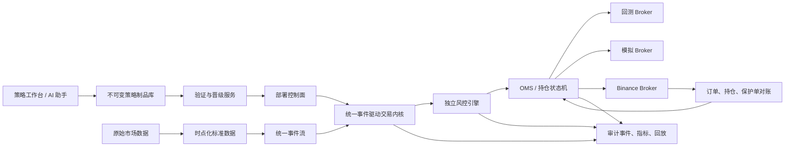

# QuantDesk 量化交易系统生产级升级方案

> 文档版本：v1.0
> 编制日期：2026-08-26
> 适用范围：策略中心、回测、历史回放、模拟盘、影子运行、Binance 实盘、数据采集、风控与运维
> 当前基线提交：`eb92a12`

## 1. 文档目的

本方案用于把 QuantDesk 从“具备完整产品形态的量化研究与模拟交易平台”升级为“能够受控运行小规模真实资金、可审计、可回放、可恢复的生产级量化交易系统”。

方案解决的核心问题不是继续增加指标、页面或 AI 功能，而是建立以下能力：

1. 同一份策略在回测、影子、模拟盘和实盘使用同一套事件语义、组合逻辑、风控和订单状态机。
2. AI 只能生成和修改策略草稿，不能绕过验证、审批和资金权限直接进入实盘。
3. 每个策略版本、数据版本、参数版本、成本模型和部署记录都可以冻结、复现和回滚。
4. 实盘订单在超时、断线、部分成交、重复回调、服务重启和保护单异常时仍能安全恢复。
5. 系统能够量化证明一个策略是否具备成本后的样本外优势，而不是依赖命中率、毛收益或页面评分。

本文档是工程升级方案，不构成收益承诺、投资建议或法律意见。

## 2. 当前系统结论

### 2.1 场景评分

| 场景 | 当前评分 | 结论 |
| --- | ---: | --- |
| AI 策略创作与交互 | 7.5 / 10 | 适合作为策略研发工作台 |
| 策略版本与审计 | 7.0 / 10 | 已有 revision、source hash、部署快照和信号审计 |
| 回测可信度 | 6.0 / 10 | 基本保守，但现实成交模型仍不完整 |
| 模拟盘长期运行 | 6.5 / 10 | 可用于验证，但不能直接代表实盘结果 |
| 回测/模拟/实盘一致性 | 5.5 / 10 | 共用部分策略求值，交易编排仍然分散 |
| 实盘执行与风控 | 6.5 / 10 | 已有幂等、对账和保护逻辑，尚未达到无人值守标准 |
| 数据工程 | 5.5 / 10 | 已使用收盘 K 线，但时点化、数据版本和原始数据留档不足 |
| 运维与可观测性 | 4.0 / 10 | 多种后台任务与 API 共进程，监控指标不足 |
| 无人值守真钱运行 | 4.5 / 10 | 当前不应放大真实资金 |
| 综合架构 | 6.0 / 10 | 研究平台合格，生产交易内核需要升级 |

### 2.2 当前值得保留的能力

- 策略版本、源码哈希、策略 revision 和不可变部署快照。
- Python AST 安全检查、隔离子进程、执行超时和输入输出限制。
- 回测在信号产生后的下一根 K 线开盘成交，避免直接使用信号 K 线收盘价成交。
- 同根 K 线同时触发止损和止盈时采用保守顺序。
- 实盘订单意图、`signal_key`、`client_order_id` 和数据库唯一约束。
- 实盘订单恢复、账户持仓对账、保护单检查和失败关闭路径。
- 预测快照、成本后收益、MFE/MAE、settlement version 和 readiness gate。
- GitHub Actions 中的后端测试、MySQL 集成测试、OpenAPI 检查、前端构建和生产镜像构建。

这些能力不应推倒重写，应当迁移到新的统一交易内核中。

### 2.3 当前关键缺口

#### A. 策略创建即发布

当前源码策略和普通策略创建后会直接进入 `published`。这使“代码通过语法和沙箱校验”与“策略可被部署”之间缺少强制验证阶段。

目标必须改为：

```text
draft
  -> validated
  -> backtested
  -> shadow
  -> paper
  -> micro_live
  -> live
  -> retired
```

#### B. 三套交易编排产生语义漂移

当前策略求值可以部分复用，但回测、模拟盘和实盘分别维护自己的持仓、止盈止损、反转、持有期和成交逻辑。长期维护必然出现同一个策略在三个环境中结果不一致。

#### C. API 与交易后台任务共进程

FastAPI 生命周期同时启动行情、K 线、新闻、社交数据、模拟盘和实盘执行。API 发布或崩溃会影响交易任务，也限制了 API 横向扩容。

#### D. AI 代码沙箱不是强多租户边界

`AST + python -I + 子进程` 可以降低风险，但不能代替容器、低权限用户、只读文件系统、禁网和资源配额。

#### E. 回测现实模型仍有缺口

需要补齐实际手续费、资金费率、标记价格、合约规则、部分成交、延迟、盘口冲击、拒单、限频和断线场景。

#### F. Readiness 尚未统一到所有策略 revision

当前 AI Monitor 已经具备较严格的成本后准入指标，但源码策略、完整策略和普通模板策略尚未统一使用相同的 revision 级晋级机制。

#### G. 可观测性不足

当前健康检查主要覆盖应用与数据库，缺少行情延迟、K 线延迟、用户数据流延迟、订单 ACK 延迟、对账差异、保护单缺口和策略决策延迟等生产指标。

## 3. 升级原则

### 3.1 AI 是研发助手，不是资金权限主体

AI 可以：

- 根据自然语言生成或修改策略草稿。
- 选择指标和运行约束。
- 生成参数定义、测试样例、风险说明和变更摘要。
- 分析回测结果并提出下一轮实验建议。

AI 不可以：

- 自动把草稿标记为可实盘。
- 修改账户级硬风险上限。
- 获取或使用交易所密钥。
- 绕过回测、影子、模拟盘和人工审批。
- 根据隐藏推理过程作为发布依据。

前端应展示结构化依据，而不是依赖模型的隐藏思维链：

- 本轮理解的需求。
- 变更的策略规则。
- 源码 diff。
- 新增或删除的参数。
- 使用的数据周期。
- 风险变化。
- 自动测试与回测结果。
- 未解决问题和发布阻断原因。

### 3.2 同一策略只允许一套执行语义

策略代码只负责根据已知市场状态产生标准化决策，不负责直接调用交易所：

```python
Decision(
    action="LONG_ENTRY | SHORT_ENTRY | EXIT | HOLD | SKIP",
    signal_time=...,
    valid_until=...,
    confidence=...,
    reason_codes=[...],
    evidence={...},
    risk_proposal={...},
)
```

仓位、订单、费用、止盈止损、持有期、保护单和账户风险由统一交易内核处理。

### 3.3 所有状态变化必须可重放

下列对象必须拥有稳定 ID、版本和事件记录：

- 市场数据事件。
- 策略 revision。
- 策略部署。
- 策略决策。
- 风控决策。
- 订单意图。
- Broker 命令。
- 订单 ACK、拒单、成交、撤单和过期事件。
- 持仓变化。
- 保护单变化。
- 人工操作和熔断动作。

### 3.4 风控独立于策略

策略只能提出风险建议，不能突破账户硬限制。账户风险服务拥有最终否决权，且在策略进程异常时仍然工作。

### 3.5 先模块化和拆进程，再考虑微服务

当前阶段不建议立即引入 Kafka、Kubernetes 和大量微服务。优先采用：

- 清晰的模块边界。
- 独立 Worker 进程。
- MySQL 事务、Outbox、租约和幂等键。
- 必要时使用 Redis 做短期缓存和分布式租约，但不把它作为交易事实来源。

## 4. 目标架构



## 5. 目标模块边界

建议将后端逐步整理为以下结构：

```text
quantdesk_v2/
  control_plane/
    strategies/
    deployments/
    approvals/
    ai_composer/

  strategy_sdk/
    contract.py
    validator.py
    artifact.py
    sandbox.py

  engine/
    events.py
    clock.py
    runtime.py
    portfolio.py
    orders.py
    positions.py

  risk/
    pre_trade.py
    continuous.py
    limits.py
    kill_switch.py

  execution/
    oms.py
    state_machine.py
    reconciliation.py
    protection.py

  adapters/
    market_data/
    replay_broker/
    paper_broker/
    binance_broker/

  data/
    raw_events.py
    normalization.py
    datasets.py
    quality.py

  workers/
    market_data_worker.py
    strategy_worker.py
    paper_worker.py
    live_worker.py
    settlement_worker.py

  observability/
    metrics.py
    alerts.py
    traces.py
```

前期以移动职责和添加适配层为主，不要求一次性移动全部旧模块。

## 6. 统一交易事件模型

### 6.1 市场事件

至少包括：

- `QuoteEvent`
- `TradeEvent`
- `BarClosedEvent`
- `OrderBookSnapshotEvent`
- `MarkPriceEvent`
- `FundingRateEvent`
- `TradingStatusEvent`
- `ContractSpecChangedEvent`

每个事件必须包含：

```text
event_id
source
symbol
event_time
available_time
received_time
sequence
schema_version
payload_hash
```

其中：

- `event_time`：市场事件发生时间。
- `available_time`：该数据在现实世界中最早可被策略使用的时间。
- `received_time`：本系统实际收到时间。

回测必须按 `available_time` 推进时间边界，避免未来函数和数据修订泄漏。

### 6.2 决策事件

```text
StrategyDecisionCreated
RiskDecisionCreated
OrderIntentCreated
OrderSubmissionRequested
OrderAcknowledged
OrderPartiallyFilled
OrderFilled
OrderRejected
OrderCanceled
OrderExpired
PositionChanged
ProtectionChanged
ReconciliationMismatchDetected
TradingHalted
```

### 6.3 幂等规则

建议使用：

```text
decision_key = deployment_id + revision_id + symbol + trigger_time + action
order_key = account_id + decision_key + order_role
```

`order_role` 包括：

- `entry`
- `stop_loss`
- `take_profit`
- `reduce`
- `close`
- `recovery_close`

相同 `order_key` 无论重试多少次，都只能映射到一个逻辑订单。

## 7. 策略制品与版本管理

### 7.1 Strategy Artifact

每个 revision 应冻结：

```json
{
  "strategy_id": "...",
  "revision_id": "...",
  "source_hash": "...",
  "runtime_image_digest": "...",
  "language": "python",
  "runtime_version": "...",
  "parameter_schema": {},
  "parameters": {},
  "data_requirements": {},
  "risk_defaults": {},
  "dependency_manifest": {},
  "unit_test_hash": "...",
  "created_via": "manual | ai",
  "created_by": "...",
  "created_at": "..."
}
```

参数变更也必须生成新 revision。禁止在部署运行期间原地修改参数。

### 7.2 生命周期状态

| 状态 | 含义 | 允许操作 |
| --- | --- | --- |
| `draft` | 编辑中 | 修改、AI 对话、校验 |
| `validated` | 代码与契约通过 | 运行研究回测 |
| `backtested` | 固定数据集的样本外验证通过 | 创建影子部署 |
| `shadow` | 实时数据求值但不下单 | 对比回放与实时决策 |
| `paper` | 使用统一 OMS 的模拟成交 | 累积成交样本 |
| `micro_live` | 极小资金试运行 | 严格限额、人工审批 |
| `live` | 受控实盘 | 按审批额度运行 |
| `retired` | 已退役 | 只读、回放、审计 |

状态只能按规则晋级，不能由普通更新接口直接指定。

### 7.3 发布记录

新增建议表：

- `strategy_artifacts`
- `strategy_validation_runs`
- `strategy_promotion_reviews`
- `strategy_approval_events`
- `strategy_run_manifests`

`strategy_run_manifests` 用于冻结一次回测、影子、模拟或实盘运行的全部输入版本。

## 8. AI 策略工作台升级

### 8.1 多轮会话模型

每一轮对话保存：

- 用户原始要求。
- AI 结构化理解。
- 修改前 revision。
- 建议源码和 diff。
- 参数 schema 变化。
- 风险默认值变化。
- 自动测试结果。
- 服务端安全校验结果。
- 用户是否采纳。

只有用户点击“采纳为新草稿”时才创建 draft revision。

### 8.2 AI 输出契约

AI 不直接返回任意散文，必须返回结构化对象：

```json
{
  "name": "...",
  "category": "...",
  "description": "...",
  "change_summary": [],
  "assumptions": [],
  "risk_warnings": [],
  "source_code": "...",
  "parameter_schema": [],
  "suggested_tests": [],
  "data_requirements": {},
  "expected_behavior": {}
}
```

### 8.3 自动验证顺序

```text
解析自然语言
  -> 生成结构化草稿
  -> AST 与策略契约检查
  -> 参数定义检查
  -> 静态复杂度检查
  -> 单元测试
  -> 确定性重复执行
  -> 小样本冒烟回放
  -> 完整样本外回测
  -> 人工确认
```

### 8.4 策略源码安全

生产目标：

- 每次执行使用一次性容器。
- 独立非 root 用户。
- 禁止网络。
- 根文件系统只读。
- 限制 CPU、内存、进程数和输出大小。
- 只挂载只读输入数据。
- 执行结束销毁容器。
- 容器镜像使用 digest 固定。

## 9. 回测系统升级

### 9.1 必须统一的行为

- 信号只读取已经闭合且在当时可获得的数据。
- 默认下一事件或下一根 K 线成交。
- 市价单、限价单、条件单使用统一订单状态机。
- 止盈止损与实盘使用同一 protection policy。
- 仓位大小与实盘使用同一 risk sizing policy。
- 合约价格步长、数量步长和最小名义价值按历史或冻结规则执行。

### 9.2 成交现实模型

至少支持：

- maker/taker 费率。
- 双边手续费。
- 实际或历史资金费率。
- 固定滑点与盘口滑点两种模式。
- 网络延迟、下单延迟和撤单延迟。
- 部分成交。
- 成交量参与率上限。
- 市场冲击压力模型。
- 标记价格清算。
- 断线与拒单情景。

### 9.3 回测结果必须记录

- 数据集 ID 和数据哈希。
- 策略 revision 和 source hash。
- 参数哈希。
- 引擎版本。
- 成交模型版本。
- 成本模型版本。
- 随机种子。
- 开始/结束时间。
- 环境镜像 digest。
- 所有交易和所有决策事件。

### 9.4 研究验证方法

禁止只根据单次全量历史回测挑参数。最低要求：

- Anchored 或 Rolling Walk-forward。
- 最终测试区间完全冻结，不参与调参。
- 相邻标签存在重叠时使用时间隔离或 purged split。
- 记录实验次数，防止多重试验过拟合。
- 按月份、行情状态、品种、方向和波动区间拆分报告。
- 使用两倍手续费和滑点压力测试。
- 报告参数扰动后的稳定性。

## 10. 模拟盘与影子运行升级

### 10.1 影子运行

影子模式读取实时数据、生成真实的决策和订单意图，但不提交 Broker 命令。

需要持续对比：

- 实时决策与同周期历史回放决策是否一致。
- 决策延迟。
- 数据延迟。
- 预估成交与真实盘口可成交价格差异。
- 预估保护单与真实交易所规则是否兼容。

### 10.2 模拟盘

模拟盘必须使用与实盘相同的：

- OMS。
- 风控引擎。
- 订单状态机。
- 保护单状态机。
- 持仓核算。
- 策略 deployment 与 revision。

唯一替换项是 `PaperBrokerAdapter`。

### 10.3 模拟成交模式

提供两档：

1. `bar_model`：适合低频研究，按 OHLC 与保守顺序成交。
2. `market_model`：使用实时 bid/ask、深度和延迟估算成交。

所有统计必须标记成交模式，不能把两种模式混在同一策略版本统计中。

## 11. 实盘 OMS 与执行恢复

### 11.1 订单状态机

建议状态：

```text
created
  -> risk_approved
  -> submitting
  -> acknowledged
  -> partially_filled
  -> filled
  -> canceling
  -> canceled
  -> rejected
  -> expired
  -> reconcile_pending
  -> failed_closed
```

状态只能单向、合法迁移。任何未知状态进入 `reconcile_pending`，禁止盲目重复提交。

### 11.2 Broker 命令恢复

必须通过以下方式处理“已发送但响应未知”：

1. 使用稳定 `client_order_id`。
2. 查询订单状态。
3. 读取用户订单流。
4. 查询当前持仓与开放订单。
5. 根据交易所状态推进本地状态。
6. 未完成对账前冻结对应账户的新开仓。

### 11.3 用户数据流

- 用户订单流作为实时订单状态的主要来源。
- REST 查询作为启动、断线和超时后的对账来源。
- 保存交易所事件时间、接收时间和 sequence。
- 发现事件缺口时立即进入对账。
- 用户数据流过期、断线或延迟超阈值时禁止新开仓。

### 11.4 保护单原则

- 开仓成交后必须立即创建保护组。
- 在保护组确认前，账户处于 `unprotected_exposure`。
- 未保护窗口超过阈值时执行 safe-close。
- 本地持仓与交易所持仓不一致时停止新增风险。
- 保护单只能 reduce-only/close-position，不得扩大敞口。
- STOP、TAKE_PROFIT 和紧急平仓必须有清晰优先级。

## 12. 独立风险引擎

### 12.1 下单前控制

- 单笔风险上限。
- 单品种名义价值上限。
- 账户总敞口上限。
- 杠杆上限。
- 最大持仓数量。
- 行业或相关簇风险上限。
- 每分钟订单与撤单次数上限。
- 价格偏离保护。
- 数据新鲜度。
- 盘口质量。
- 账户持仓对账状态。
- 保护单完整性。
- 策略 revision 的晋级状态。

### 12.2 持续控制

- 日亏损熔断。
- 账户总回撤熔断。
- 连续亏损冷却。
- 实际滑点偏离熔断。
- 策略实时表现偏离回测置信范围。
- 数据源延迟或中断。
- 订单拒单率异常。
- 保护单缺失。
- 本地与交易所敞口不一致。

### 12.3 熔断层级

```text
global
account
strategy revision
symbol
data source
broker connection
```

任何熔断动作必须持久化并产生审计事件，恢复也必须经过显式操作或满足自动恢复条件。

## 13. 数据架构升级

### 13.1 数据分层

| 层级 | 内容 | 存储建议 |
| --- | --- | --- |
| Raw | 交易所原始响应、WebSocket 事件 | 压缩对象文件/对象存储 |
| Normalized | 标准 Quote、Trade、Bar、Funding | MySQL 热数据 + Parquet 历史数据 |
| Feature | 指标、特征和特征版本 | MySQL/Parquet |
| Decision | 决策、证据、风险快照 | MySQL 不可变记录 |
| Execution | 订单、成交、持仓、对账事件 | MySQL 强一致记录 |
| Analytics | 聚合统计和页面读模型 | 独立 projection 表 |

### 13.2 Point-in-time 数据要求

所有研究数据必须明确“当时是否可获得”。新闻、财报、事件、行情和修订数据都不能只保存业务时间，还要保存采集时间与可用时间。

### 13.3 数据质量门槛

- 缺失率。
- 重复率。
- 时间倒序。
- sequence 缺口。
- OHLC 合法性。
- 异常跳价。
- 跨数据源价格偏差。
- 最后更新时间。
- 交易状态和休市状态。

数据质量不满足时必须 fail closed，不能把“无数据”解释为“条件通过”。

## 14. 进程与部署拓扑

### 14.1 第一阶段部署

```text
nginx
  -> api process

systemd/docker:
  quantdesk-api
  quantdesk-market-data
  quantdesk-strategy-worker
  quantdesk-paper-worker
  quantdesk-live-worker
  quantdesk-settlement-worker
  mysql
```

每个进程拥有独立健康检查和重启策略。

### 14.2 Worker 所有权

- 使用数据库 lease 或 advisory lock 保证同一任务只有一个 owner。
- lease 必须有过期时间和心跳。
- 任务接管前读取 checkpoint。
- 交易 Worker 不允许多个实例同时控制同一物理账户。
- API 实例可以水平扩容，但不能自动启动交易线程。

### 14.3 发布流程

```text
Git commit
  -> CI
  -> 构建不可变镜像
  -> 数据库迁移预检查
  -> 影子环境
  -> 生产 canary
  -> 健康与对账检查
  -> 扩大发布
  -> 保留一键回滚镜像
```

禁止在服务器上直接修改源码。

## 15. 可观测性与告警

### 15.1 必须采集的指标

#### 行情

- WebSocket 连接状态。
- 最近事件时间。
- 事件接收延迟。
- K 线闭合延迟。
- sequence 缺口数量。
- REST 降级次数。
- 数据源错误率和限频次数。

#### 策略

- 每个 revision 的求值次数和延迟。
- LONG/SHORT/HOLD/SKIP 分布。
- 沙箱超时和失败次数。
- 信号新鲜度拒绝次数。
- 回放与实时决策不一致数量。

#### 订单

- 提交到 ACK 延迟。
- ACK 到成交延迟。
- 拒单率。
- 部分成交持续时间。
- 对账差异数量。
- 未知订单数量。
- 保护单缺口持续时间。

#### 风险

- 当前账户总敞口。
- 单品种和相关簇敞口。
- 日内损益和回撤。
- 熔断状态。
- 风控拒绝原因分布。
- 未纳管持仓数量。

### 15.2 告警等级

| 等级 | 示例 | 动作 |
| --- | --- | --- |
| P0 | 未保护持仓、重复订单、账户持仓不一致 | 停止新开仓并立即通知 |
| P1 | 用户数据流断线、行情严重延迟、对账失败 | 冻结账户并自动恢复/对账 |
| P2 | 策略超时率升高、滑点偏离、数据覆盖下降 | 降级或暂停对应策略 |
| P3 | 普通采集源暂时失败 | 重试并记录 |

## 16. 策略晋级标准

### 16.1 Backtested -> Shadow

最低要求：

- 样本外跨度不少于 180 天。
- 样本数量达到策略频率对应门槛。
- 成本后平均收益 95% 置信区间下限大于 0。
- 成本后利润因子不低于 1.20。
- 双倍成本压力下平均收益仍为正。
- 至少 5 个独立月份为正。
- 单一品种贡献不超过总正收益的 20%。
- 最大回撤低于策略审批阈值。
- 参数在邻近范围内表现稳定。

### 16.2 Shadow -> Paper

- 实时影子运行不少于 4 周。
- 回放与实时决策一致率达到 99.9% 以上。
- 无未来数据、数据源错配或重复决策事故。
- 数据延迟和求值延迟满足 SLO。

### 16.3 Paper -> Micro Live

- 同执行链模拟盘至少 100 笔成交。
- 扣除真实估算成本后为正。
- 实际模拟滑点不高于压力模型。
- 订单、保护和恢复事故为 0。
- 完成断线、超时、部分成交、重复回调和服务重启演练。
- 人工审批通过。

### 16.4 Micro Live -> Live

- 微型实盘运行不少于 4 周或达到审批成交样本。
- 实际成交与影子模型偏差在阈值内。
- 无重复下单、裸仓和未纳管持仓。
- 收益和回撤没有显著突破样本外置信范围。
- 新的资金上限经过再次审批。

## 17. 微型实盘默认限制

建议默认：

| 项目 | 建议值 |
| --- | ---: |
| 单笔账户风险 | 0.05%～0.10% |
| 总开放风险 | 不超过 0.50% |
| 最大同时持仓 | 2 |
| 杠杆 | 1～2 倍 |
| 日亏损熔断 | 0.50% |
| 总回撤熔断 | 2.00% |
| 单品种资金占用 | 不超过账户权益 10% |
| 自动加码 | 禁止 |
| 马丁格尔 | 禁止 |
| 未保护仓位容忍时间 | 尽可能为 0，超过阈值立即 safe-close |

## 18. 数据库升级建议

### 18.1 新增或扩展表

#### `strategy_artifacts`

- revision_id
- source_hash
- runtime_image_digest
- parameter_hash
- dependency_hash
- artifact_manifest_json

#### `strategy_validation_runs`

- revision_id
- validation_type
- status
- report_json
- started_at
- completed_at

#### `strategy_promotion_reviews`

- revision_id
- from_stage
- to_stage
- gate_result_json
- requested_by
- approved_by
- status
- created_at

#### `strategy_run_manifests`

- deployment_id
- revision_id
- mode
- data_set_id
- engine_version
- cost_model_version
- fill_model_version
- risk_policy_version
- manifest_hash

#### `market_raw_events`

高频原始数据不一定全部长期保存在 MySQL，可在表中保存文件分片索引、范围和哈希。

#### `execution_events`

- execution_id
- sequence
- event_type
- exchange_event_time
- received_at
- payload_json
- payload_hash

### 18.2 兼容策略

- 旧策略统一标记为 `legacy_published` 或迁移为 `published` 但禁止新增实盘绑定。
- 已运行模拟盘保留原快照，不自动切换 revision。
- 已运行实盘必须暂停后才能更换 revision。
- 新旧引擎并行一段时间，通过影子对比确认一致性后再切换。

## 19. API 升级建议

新增建议接口：

```text
POST /api/v2/strategies/{id}/validate
POST /api/v2/strategies/{id}/backtests
POST /api/v2/strategies/{id}/promotion-requests
POST /api/v2/strategies/{id}/promotion-requests/{request_id}/approve
POST /api/v2/strategies/{id}/deployments
POST /api/v2/deployments/{id}/pause
POST /api/v2/deployments/{id}/resume
POST /api/v2/deployments/{id}/rollback
GET  /api/v2/deployments/{id}/manifest
GET  /api/v2/deployments/{id}/reconciliation
GET  /api/v2/strategies/{id}/readiness
GET  /api/v2/system/trading-readiness
POST /api/v2/risk/kill-switch
```

所有会扩大真实资金风险的接口必须：

- 二次确认。
- 重新验证当前用户和账户权限。
- 写审计日志。
- 使用幂等请求 ID。
- 返回实际绑定的 revision 和 risk policy 版本。

## 20. 测试体系

### 20.1 单元测试

- 策略 SDK。
- 指标和参数解析。
- 风控规则。
- 订单状态迁移。
- 保护单规则。
- 成本与 PnL 计算。

### 20.2 契约测试

- Binance REST 请求与响应。
- Binance 用户数据流事件。
- Finnhub 与其他数据源。
- BrokerAdapter 与 OMS。
- MarketDataAdapter 与 EventEngine。

### 20.3 属性与确定性测试

- 相同事件流必须得到相同决策和订单意图。
- 重放同一事件两次不能产生重复逻辑订单。
- 任意非法订单状态迁移必须失败。
- 风控拒绝不能因重试变成放行。
- PnL、余额和持仓守恒。

### 20.4 故障注入测试

必须覆盖：

- 下单请求到达交易所后应用超时。
- ACK 到达前进程崩溃。
- 部分成交后断线。
- STOP 创建成功、TAKE_PROFIT 创建失败。
- 用户数据流事件重复或缺失。
- REST 对账暂时不可用。
- 数据库提交失败。
- Worker 租约切换。
- API 发布重启。
- 服务器重启。

### 20.5 生产验收关键用例

1. 在订单提交后、响应返回前强制杀进程，恢复后不得重复下单。
2. 删除一张保护单，系统必须停止新开仓并自动修复或安全平仓。
3. 人工制造本地持仓与交易所持仓不一致，系统必须进入风险复核。
4. 让行情延迟超过阈值，系统不得生成新订单。
5. 对同一 revision 和数据集重复回放，决策与订单事件必须完全一致。

## 21. 分阶段实施计划

### Phase 0：实盘防火墙，1～2 周

目标：任何新策略都不能绕过验证直接进入实盘。

| ID | 任务 | 优先级 |
| --- | --- | --- |
| P0-01 | 新策略默认 `draft` | P0 |
| P0-02 | 建立生命周期状态机和迁移约束 | P0 |
| P0-03 | 实盘绑定必须检查 revision 晋级状态 | P0 |
| P0-04 | AI 生成策略禁止自动 published | P0 |
| P0-05 | revision 级 readiness API | P0 |
| P0-06 | 全局/账户/策略 kill switch | P0 |
| P0-07 | 发布、回滚和审批审计事件 | P0 |

验收：未审批 revision 无法创建或更新实盘部署。

### Phase 1：统一交易内核，3～5 周

目标：停止维护三套止盈止损和持仓语义。

| ID | 任务 | 优先级 |
| --- | --- | --- |
| P1-01 | 定义统一 MarketEvent/Decision/OrderEvent | P0 |
| P1-02 | 抽取 StrategyRuntime | P0 |
| P1-03 | 抽取 Portfolio 与 OMS | P0 |
| P1-04 | 抽取统一 protection policy | P0 |
| P1-05 | 实现 ReplayBrokerAdapter | P0 |
| P1-06 | 实现 PaperBrokerAdapter | P0 |
| P1-07 | 适配现有 Binance 执行代码 | P0 |
| P1-08 | 新旧引擎信号与订单影子对比 | P1 |

验收：同一事件流在 replay/paper/shadow 中产生一致 decision ID 和订单意图。

### Phase 2：数据和回测可信化，3～4 周

| ID | 任务 | 优先级 |
| --- | --- | --- |
| P2-01 | 建立 availability_time 与 dataset manifest | P0 |
| P2-02 | 原始行情和数据修订留档 | P1 |
| P2-03 | 资金费率与标记价格回测 | P0 |
| P2-04 | 合约规则历史快照 | P0 |
| P2-05 | 部分成交、延迟和拒单模型 | P1 |
| P2-06 | Walk-forward 与样本外报告 | P0 |
| P2-07 | 参数稳定性和双倍成本压力测试 | P0 |

验收：任意回测结果可以通过 manifest 完整复现。

### Phase 3：拆分 Worker 与执行恢复，3～5 周

| ID | 任务 | 优先级 |
| --- | --- | --- |
| P3-01 | API 不再启动交易后台线程 | P0 |
| P3-02 | 独立行情 Worker | P0 |
| P3-03 | 独立 Paper Worker | P1 |
| P3-04 | 独立 Live Worker | P0 |
| P3-05 | Outbox、lease 和 checkpoint | P0 |
| P3-06 | 用户数据流事件持久化 | P0 |
| P3-07 | 启动/周期/故障后对账 | P0 |
| P3-08 | Worker 独立健康检查 | P1 |

验收：API 重启不影响行情和交易 Worker；Live Worker 崩溃恢复后无重复订单。

### Phase 4：可观测性与受控实盘，4～6 周

| ID | 任务 | 优先级 |
| --- | --- | --- |
| P4-01 | Prometheus/OpenTelemetry 指标 | P1 |
| P4-02 | P0/P1 风险告警 | P0 |
| P4-03 | Shadow -> Paper 自动准入报告 | P0 |
| P4-04 | Micro Live 审批和资金上限 | P0 |
| P4-05 | 线上与 OOS 回放偏差监控 | P1 |
| P4-06 | 故障演练与恢复报告 | P0 |
| P4-07 | 自动暂停与人工恢复流程 | P0 |

验收：完成至少 4 周影子、100 笔同执行链模拟成交和全部故障演练后，才开放微型实盘审批。

## 22. 推荐人员与工期

### 最低配置

- 1 名后端/交易引擎工程师。
- 1 名数据/后端工程师。
- 1 名前端工程师可按阶段参与。
- 1 名负责人承担风险规则、验收和发布审批。

### 预计周期

| 阶段 | 预计时间 |
| --- | ---: |
| Phase 0 | 1～2 周 |
| Phase 1 | 3～5 周 |
| Phase 2 | 3～4 周 |
| Phase 3 | 3～5 周 |
| Phase 4 | 4～6 周 |

部分任务可以并行。两名熟悉现有代码的后端工程师，完成可进入微型实盘审批的第一版，预计需要 12～16 周。该工期不包含积累 4 周影子运行和 100 笔模拟成交所需的自然等待时间。

## 23. 技术选型建议

### 23.1 继续自研

优点：

- 最大程度保留现有功能和数据模型。
- 迁移风险低。
- 能针对 Binance TradFi 合约做定制。

风险：

- 需要持续维护订单、回测、风控和对账语义。
- 对交易引擎工程能力要求较高。

### 23.2 引入 NautilusTrader

适合作为统一事件内核的候选：

- Python 控制面。
- 统一回测和实盘策略语义。
- 事件驱动、订单状态、投资组合、风控和执行对账。
- 官方支持 Binance Spot、USD-M 和 COIN-M。

建议先进行两周技术验证：

1. 选择一个最简单的 EMA 策略。
2. 导入 QuantDesk 历史 K 线。
3. 对接 Binance Demo/Testnet 或影子适配器。
4. 比较信号、成交、资金费率、止盈止损和恢复能力。
5. 评估能否保留现有策略中心和数据库控制面。

### 23.3 引入 LEAN

LEAN 非常成熟，也支持 Binance Crypto/Futures，但核心技术栈是 C#。若团队主要维护 Python，整体迁移、二次开发和部署复杂度通常高于 NautilusTrader。

### 23.4 推荐决策

不立即重写整个项目。保留现有 UI、用户系统、AI、研究数据和管理后台，同时：

1. 先完成 Phase 0。
2. 并行做 NautilusTrader 两周 PoC。
3. 如果 PoC 能覆盖 Binance TradFi 合约、资金费率、保护单和当前策略接口，则逐步用其替换底层 Engine。
4. 如果 PoC 不满足业务要求，则按相同事件模型继续自研 Engine V2。

## 24. 风险清单

| 风险 | 影响 | 缓解措施 |
| --- | --- | --- |
| 新旧引擎结果不一致 | 无法安全迁移 | 双跑、事件级 diff、按 revision 灰度 |
| 数据历史不足 | 无法证明优势 | 保持 research 状态，禁止提前放行 |
| AI 生成过拟合策略 | 虚假回测优势 | 样本外、实验次数、稳定性与压力测试 |
| 交易所接口变化 | 拒单或保护失败 | 合约测试、版本监控、fail closed |
| 服务重启重复下单 | 真实资金损失 | client order ID、意图日志、启动对账 |
| 部分成交处理错误 | 裸仓或超额仓位 | OMS 状态机、事件重放、故障注入测试 |
| 行情和订单流中断 | 使用过期数据交易 | 数据新鲜度门槛、账户冻结、REST 对账 |
| 单服务器故障 | 全系统停止 | Worker 拆分、备份、恢复演练、后续主备 |
| 策略 sandbox 逃逸 | 服务器安全风险 | 容器禁网、只读、低权限、资源配额 |
| 模块继续膨胀 | 修改风险持续上升 | 按边界拆分大文件、架构测试、owner 制度 |

## 25. 第一迭代建议

第一轮不要继续增加新指标或页面，直接执行以下任务：

1. `P0-01`：新策略默认 draft。
2. `P0-02`：建立生命周期状态机。
3. `P0-03`：实盘部署校验 revision 晋级状态。
4. `P0-04`：AI 只能创建 draft revision。
5. `P0-05`：统一 revision readiness 报告。
6. `P0-06`：全局/账户/策略熔断。
7. `P1-01`：定义统一事件协议。
8. `P1-02`：建立纯 StrategyRuntime 接口。
9. 为现有回测、模拟和实盘增加“决策一致性对比日志”。
10. 选择 EMA 策略进行 Engine V2/NautilusTrader PoC。

第一迭代完成后，预期架构可靠度可由约 6/10 提升到约 6.8/10；完成统一交易内核和执行恢复后，受控小资金实盘可靠度可接近 7/10。是否继续扩大资金仍必须由真实样本、故障演练和成本后结果决定。

## 26. 完成定义

系统只有同时满足以下条件，才能宣称“生产级微型实盘就绪”：

- AI 生成策略不能直接发布或绑定实盘。
- 回测、影子、模拟和实盘共用策略、风控和订单状态机。
- 每次运行都有完整 manifest，可重复回放。
- 已发送但响应未知的订单能够通过对账安全恢复。
- 服务重启、断线和部分成交不会产生重复订单。
- 保护单缺失会自动冻结并安全处理风险。
- 行情、订单、策略和风险指标具备 P0/P1 告警。
- 策略 revision 已通过样本外、压力、影子和模拟盘门槛。
- 微型实盘额度经过人工审批。
- 完成并留档全部关键故障演练。

在此之前，系统应明确标记为 `research`、`shadow` 或 `paper`，不使用“实盘就绪”作为产品宣传。

## 27. 实施记录（2026-08-26）

第一批 Phase 0 门禁已完成：

- 策略与 revision 增加 `draft → validated → backtested → shadow → paper → micro_live → live` 生命周期。
- 新建及修改源码/参数后统一回到 `draft`，不能沿用旧 revision 的验证结论。
- 静态校验、回测结果和部署证据均绑定具体 revision，并由服务端 readiness 接口判定。
- 回测、模拟盘、微型实盘和正式实盘按阶段拒绝越级使用；旧 `published` 状态不再视为实盘授权。
- 实盘 worker 增加运行时 revision 防线：未晋级到 `micro_live/live` 的策略不能新增风险，但仍允许平仓和保护性操作。
- 晋级操作要求显式确认、乐观锁版本并写入审计日志；前端展示中文状态、检查项、阻断原因和下一阶段。

尚未完成且不得视为已具备生产能力：

- 真实 shadow 执行器及其绩效、偏差和稳定性证据。
- 全局、账户、策略三级 kill switch 与旧实盘 worker 控制面的持久化接线。
- 统一回测/模拟/实盘交易内核、订单状态机、对账恢复和故障演练。
- 旧策略到新生命周期的人工复核、重新回测和逐级晋级。

## 28. 参考资料

- QuantConnect LEAN Algorithm Engine：<https://www.quantconnect.com/docs/v2/writing-algorithms/key-concepts/algorithm-engine>
- QuantConnect Live Reconciliation：<https://www.quantconnect.com/docs/v2/cloud-platform/live-trading/reconciliation>
- NautilusTrader Architecture：<https://nautilustrader.io/docs/latest/concepts/architecture/>
- NautilusTrader Live Trading：<https://nautilustrader.io/docs/latest/concepts/live/>
- NautilusTrader Binance Integration：<https://nautilustrader.io/docs/latest/integrations/binance/>
- Binance Developer Documentation：<https://developers.binance.com/en/docs/introduction>
- Binance USD-M User Data Streams：<https://developers.binance.info/en/docs/products/derivatives-trading-usds-futures/user-data-streams>
- FINRA Algorithmic Trading：<https://www.finra.org/rules-guidance/key-topics/algorithmic-trading>
- FINRA Regulatory Notice 15-09：<https://www.finra.org/rules-guidance/notices/15-09>
- SEC Rule 15c3-5 Overview：<https://www.sec.gov/rules-regulations/2011/06/risk-management-controls-brokers-or-dealers-market-access>
